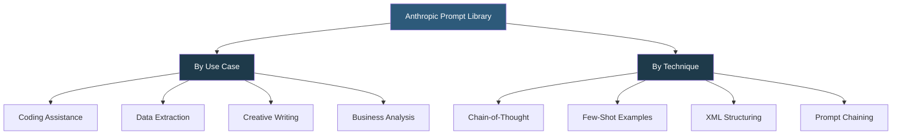

**Category:** AI Model Marketplaces
**Difficulty:** Beginner
**Reading time:** 5 min read

---

The Anthropic Prompt Library is a curated collection of example prompts published by Anthropic to demonstrate best practices for interacting with Claude models. It serves as both a learning resource and a starting point for developers building applications, covering use cases from code generation to creative writing to data analysis.

- **System prompt** — an instruction block passed before user messages that defines Claude's persona, constraints, and output format
- **Few-shot example** — an example input/output pair included in a prompt to guide the model's response format and style
- **Chain-of-thought prompting** — instructing the model to reason step-by-step before giving a final answer, improving accuracy on complex tasks
- **Prompt chaining** — breaking a complex task into a sequence of simpler prompts where each output feeds into the next
- **XML tags** — Anthropic's recommended method for structuring multi-part prompt content (e.g., `<document>`, `<instructions>`) that Claude reliably interprets
- **Metaprompt** — a prompt that generates other prompts; Anthropic's library includes a metaprompt for automatically generating task-specific system prompts

The Prompt Library at docs.anthropic.com/en/prompt-library presents each prompt as a use case with a system prompt, example user message, and example Claude response. Prompts can be copied directly and tested in the Claude.ai interface or integrated into applications via the API.

Anthropic's guidelines emphasize several patterns that improve Claude's reliability. XML tags delineate document sections clearly (`<document>content</document>`) and prevent the model from misinterpreting instructions embedded in user data. Explicit format instructions (e.g., "respond in JSON with keys 'name', 'category', 'confidence'") produce consistent structured output.

For complex reasoning tasks, prompts that instruct Claude to "think step by step" before answering, or that use extended thinking mode (`betas: ["extended-thinking"]`), substantially improve accuracy on math, logic, and multi-step reasoning tasks. The library demonstrates these patterns with concrete examples.

The Metaprompt in the library is a specialized system prompt that takes a task description as input and generates a high-quality system prompt for that task. It demonstrates how to automate prompt engineering for application builders who need to dynamically generate prompts.

- Using the CSV data transformation prompt as a starting point for a data processing application
- Adapting the code review prompt for an automated PR review bot
- Learning XML structuring patterns by studying how Anthropic's examples handle multi-document inputs
- Using the metaprompt to auto-generate system prompts for new workflow automation tasks

| Advantage | Disadvantage |
|-----------|--------------|
| Prompts are tested against current Claude models; high reliability | Library is Claude-specific; patterns may not transfer directly to other LLMs |
| Free, authoritative resource from the model creator | Coverage is illustrative, not exhaustive; niche use cases may not be represented |
| XML and formatting patterns reflect Claude's training, maximizing instruction adherence | Examples may be updated when model versions change; older patterns can become suboptimal |

- [OpenAI Cookbook Recipes](openai-cookbook-recipes.md)
- [PromptBase Model Marketplace](promptbase-model-marketplace.md)
- [LangChain Hub](langchain-hub.md)

---
*Part of the [AI Model Marketplaces](index.md) category · [Back to Master Index](../../index.md)*
