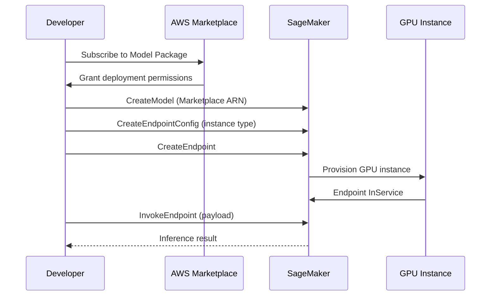

**Category:** AI Model Marketplaces
**Difficulty:** Intermediate
**Reading time:** 6 min read

---

AWS Marketplace for ML provides a commercial distribution channel where third-party vendors sell pre-packaged machine learning models, algorithms, and data products deployable directly into AWS accounts via Amazon SageMaker. It combines the discovery convenience of a marketplace with the enterprise trust of AWS billing, IAM integration, and VPC deployment.

- **SageMaker Model Package** — the deployable unit in AWS Marketplace; contains container image references and inference code ready for SageMaker Endpoints
- **Algorithm** — a marketplace listing that provides a training container image, enabling buyers to train models on their own data using SageMaker Training Jobs
- **AWS Data Exchange** — a related service for purchasing curated ML-ready datasets alongside models
- **Private Marketplace** — an AWS feature allowing enterprises to restrict employees to approved marketplace listings only
- **SageMaker JumpStart** — AWS's curated model catalog within SageMaker that includes both Marketplace models and open-source models with one-click deployment
- **Pay-as-you-go pricing** — marketplace model listings charge per inference hour or per prediction, billed through AWS consolidated billing

When a developer subscribes to a marketplace model, AWS records the subscription in their account and grants permission to reference the model package ARN in SageMaker API calls. The model package contains a pointer to a vendor's container image stored in Amazon ECR; SageMaker pulls this image and deploys it on the requested instance type.

The vendor never gains access to the buyer's AWS account or data. Inference payloads go from the buyer's application to the SageMaker Endpoint (running in the buyer's VPC), through the container, and back. Billing flows through AWS consolidated billing — the marketplace usage fee appears as a line item separate from SageMaker compute costs, simplifying procurement.

SageMaker JumpStart is the more developer-friendly interface, aggregating both Marketplace listings and popular open-source models (Llama, Mistral, Stable Diffusion) into a single UI with pre-filled deployment configurations. JumpStart models deploy with one click, selecting default instance types based on model size and providing sample notebooks for testing.

Marketplace models can be deployed with SageMaker Asynchronous Inference (for large payloads processed in batch) or Real-Time Inference Endpoints. Multi-model endpoints allow hosting multiple model package variants on a single instance, reducing idle compute costs.

- Deploying a specialized NLP model from a vendor without in-house ML expertise to train it
- Restricting a development team to approved models using AWS Private Marketplace governance
- Combining a marketplace vision model with proprietary training data using an Algorithm listing
- Integrating marketplace billing with existing AWS consolidated billing for simplified procurement

| Advantage | Disadvantage |
|-----------|--------------|
| Billing through AWS consolidated billing simplifies enterprise procurement | Models from smaller vendors may have limited documentation or support |
| VPC deployment keeps inference data within buyer's AWS account | Vendor model containers are opaque; buyers cannot inspect the model code |
| Private Marketplace enables enterprise governance over approved models | Marketplace catalog is narrower than Hugging Face Hub for cutting-edge research models |

- [Google Model Garden](google-model-garden.md)
- [Azure AI Model Catalog](azure-ai-model-catalog.md)
- [Model Usage Terms](model-usage-terms.md)

---
*Part of the [AI Model Marketplaces](index.md) category · [Back to Master Index](../../index.md)*
