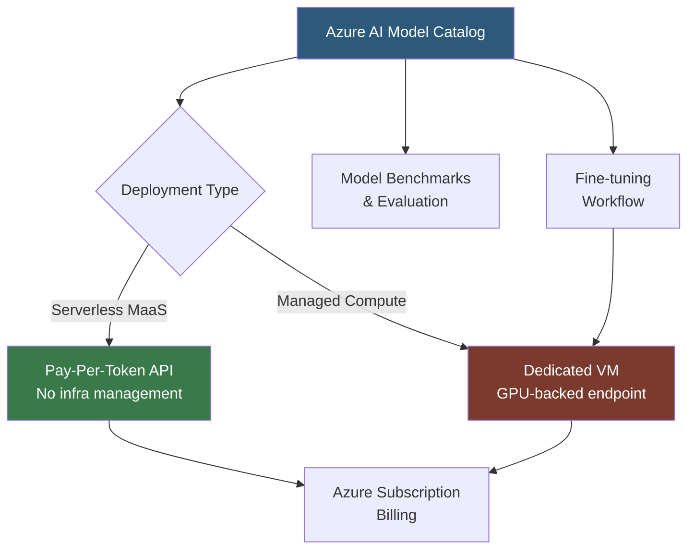

**Category:** AI Model Marketplaces
**Difficulty:** Intermediate
**Reading time:** 6 min read

---

Azure AI Model Catalog within Azure AI Studio provides a curated library of foundation models from Microsoft, OpenAI, Meta, Mistral, and other partners, deployable as managed endpoints or via serverless APIs within the Azure ecosystem. It unifies model discovery, evaluation, and deployment with Azure's enterprise governance, compliance, and billing infrastructure.

- **Azure AI Studio** — the web-based portal and SDK that hosts the Model Catalog and provides model testing, fine-tuning, and deployment workflows
- **Managed compute deployment** — deploying a model onto a dedicated Azure VM with a specific GPU SKU (e.g., Standard_NC24ads_A100_v4)
- **Serverless API (MaaS)** — Models as a Service; pay-per-token access to models without managing infrastructure, billing through Azure subscriptions
- **Model benchmarks** — standardized evaluation results embedded in each catalog entry for accuracy, coherence, fluency, and groundedness
- **Azure OpenAI Service** — a separate but related service offering OpenAI's GPT-4 and o-series models with Azure enterprise SLAs and compliance certifications
- **Responsible AI dashboard** — Azure's built-in tooling for analyzing model fairness, error analysis, and interpretability before deployment

The Model Catalog is accessed through Azure AI Studio at ai.azure.com. Models are organized by collection (OpenAI, Meta Llama, Mistral, Cohere, etc.) and task type. Each model card shows benchmark scores on MMLU, TruthfulQA, and code benchmarks alongside safety evaluations.

Serverless API deployments (MaaS) provision a shared inference endpoint behind an Azure API Management gateway. The developer receives an endpoint URL and key; requests are billed per million tokens through the Azure subscription. This model requires no GPU provisioning and scales automatically. As of 2024, Llama 3, Mistral Large, and Cohere Command R+ are available as serverless endpoints.

Managed compute deployments create a real-time endpoint backed by Azure Container Instances or AKS with GPU VMs. The developer chooses the instance SKU, and Azure provisions the container (using a curated inference container from Microsoft Container Registry) with the model weights. These endpoints have fixed costs regardless of usage but provide predictable latency.

Fine-tuning in the catalog follows a wizard-based flow: upload a JSONL training file to Azure Blob Storage, select a base model, configure hyperparameters, and submit a fine-tuning job. Completed fine-tuned models are registered in the Azure ML model registry and can be deployed like any catalog model.

- Accessing GPT-4 with Azure compliance certifications for healthcare or financial services applications
- Testing Llama 3 70B versus Mistral Large on domain-specific prompts using catalog benchmark tools
- Deploying a Phi-3 Mini model on managed compute for edge-adjacent, cost-sensitive inference
- Fine-tuning Mistral on enterprise data within Azure's VNet, keeping training data in the subscription

| Advantage | Disadvantage |
|-----------|--------------|
| Azure compliance certifications (ISO 27001, HIPAA BAA) enable regulated industry deployment | Azure-specific authentication and networking; not portable to other clouds without rework |
| Serverless MaaS eliminates GPU management for variable workloads | Serverless endpoints may have higher per-token cost than self-hosted alternatives at scale |
| Integrated responsible AI tooling simplifies bias and fairness analysis | Catalog model selection may lag Hugging Face Hub for very recent open-source releases |

- [Google Model Garden](google-model-garden.md)
- [AWS Marketplace ML Models](aws-marketplace-ml-models.md)
- [Model Safety Ratings](model-safety-ratings.md)

---
*Part of the [AI Model Marketplaces](index.md) category · [Back to Master Index](../../index.md)*
