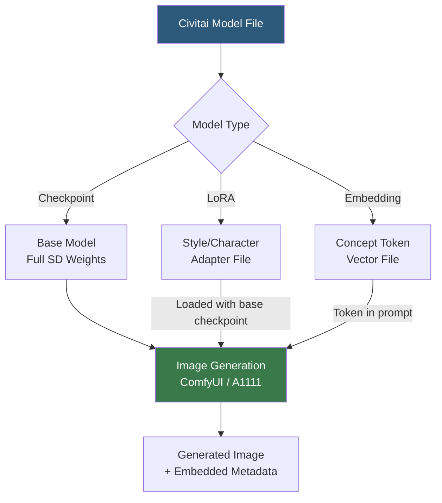

**Category:** AI Model Marketplaces
**Difficulty:** Beginner
**Reading time:** 5 min read

---

Civitai is the largest community platform for sharing Stable Diffusion models, LoRA adapters, embeddings, and image generation resources. It hosts millions of user-generated model files alongside generated image galleries, enabling artists and developers to discover fine-tuned checkpoints for specific visual styles, characters, and artistic techniques.

- **Checkpoint model** — a full Stable Diffusion model file (`.safetensors` or `.ckpt`) that defines the base image generation capability
- **LoRA (Low-Rank Adaptation)** — a small adapter file trained on specific subjects or styles that modifies a base checkpoint's output without replacing it
- **Textual Inversion (embedding)** — a tiny trained vector file that teaches a base model a new concept triggered by a custom token string
- **NSFW content** — Civitai hosts adult content behind an account-gated filter; this is a key differentiation from mainstream model hubs
- **Model trigger words** — specific text strings that activate the style or concept a LoRA or embedding was trained on
- **Generation metadata** — Civitai images include embedded metadata showing the prompt, negative prompt, sampler, and model used, enabling exact reproduction

Civitai functions as a GitHub-like social platform for generative AI assets. Model creators upload checkpoint files, LoRAs, or embeddings alongside example generation images and prompts. Each model page shows download statistics, user ratings, community reviews, and the version history.

Model files are downloaded directly and used with local inference UIs (Automatic1111, ComfyUI) or via the Civitai API. The Civitai API provides programmatic model search and download, supporting integration into automated pipelines. Downloaded LoRAs are placed in the `models/Lora/` directory of the inference UI and activated by adding `<lora:filename:weight>` to the prompt.

Generation metadata embedded in Civitai gallery images uses the PNG Info standard. Opening a Civitai image in Automatic1111's PNG Info tab reveals the complete generation recipe, enabling users to reproduce the exact output by clicking "Send to txt2img."

Content moderation is layered: a basic NSFW filter hides adult content by default, unlockable by account holders who verify their age. Some content is restricted to users who specifically enable it in settings. This permissive content policy has made Civitai controversial but has also driven its growth as the dominant generative AI asset platform.

- Finding a LoRA trained on a specific anime art style to apply to Stable Diffusion XL generations
- Downloading a photorealistic portrait checkpoint for product photography mock-ups
- Sharing a fine-tuned character LoRA with the community after training on original artwork
- Using generation metadata from gallery images to replicate a specific visual aesthetic

| Advantage | Disadvantage |
|-----------|--------------|
| Largest collection of SD checkpoints and LoRAs; highly specialized styles available | Copyright and consent concerns with models trained on scraped artwork without creator permission |
| Generation metadata sharing enables reproducible image generation workflows | Inconsistent model quality; some uploads are poorly trained or mislabeled |
| Active community provides reviews, ratings, and trigger word documentation | NSFW content on platform raises brand concerns for professional usage contexts |

- [Replicate Model Explorer](replicate-model-explorer.md)
- [Model Community Ratings](model-community-ratings.md)
- [Pre-trained Model Licensing](pre-trained-model-licensing.md)

---
*Part of the [AI Model Marketplaces](index.md) category · [Back to Master Index](../../index.md)*
