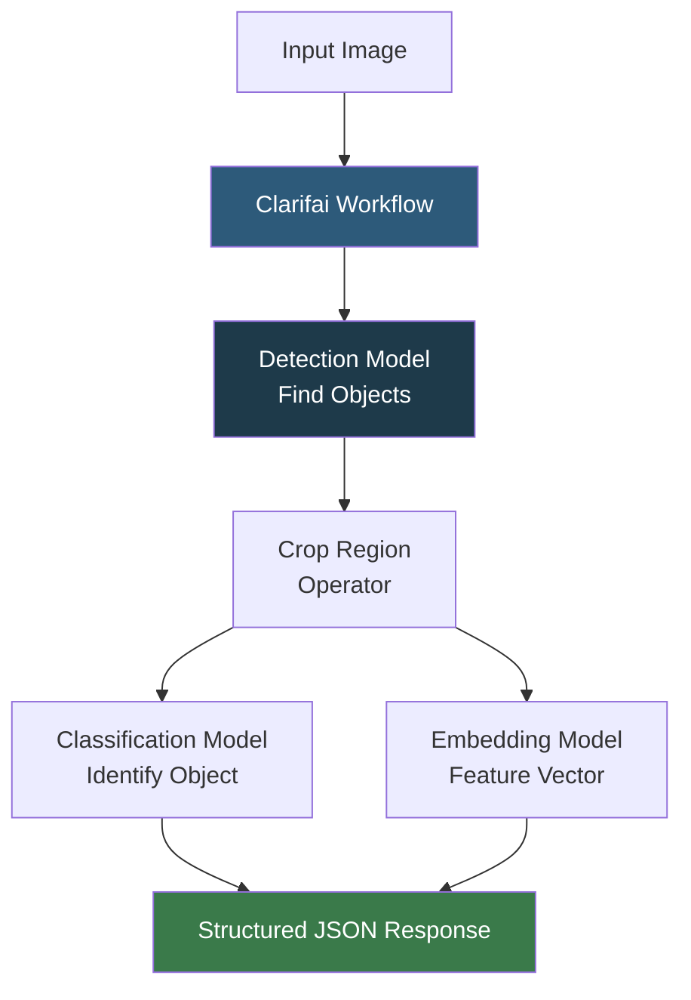

**Category:** AI Model Marketplaces
**Difficulty:** Beginner
**Reading time:** 5 min read

---

Clarifai Community is the public model and workflow sharing portal within the Clarifai AI platform, offering pretrained computer vision, NLP, and audio models alongside community-contributed custom models. Clarifai's distinguishing feature is its workflow system, which chains multiple models into multi-step inference pipelines deployable as single API calls.

- **Clarifai model** — a trained AI model hosted on Clarifai's infrastructure and callable via the Clarifai API
- **Workflow** — a directed graph of model nodes on Clarifai that processes inputs through a configurable sequence of models (e.g., detect faces, then recognize emotions)
- **Clarifai API** — the REST and gRPC API for submitting images, text, or audio and receiving structured predictions
- **Concept** — Clarifai's term for an output class; visual concepts can be recognized by built-in models or trained via custom training
- **App** — a Clarifai project container that holds models, datasets, workflows, and configuration
- **Annotation** — labeled training examples within a Clarifai app, used for custom model training

Clarifai's platform stores models in its central registry and exposes them through a unified gRPC/REST API. The API accepts inputs as URLs or base64 blobs and returns predictions in a structured `Output` proto with typed fields for concepts, regions, embeddings, or text depending on the model type.

Workflows chain models using a visual editor or workflow config YAML. Each node in a workflow declares its input source (either the original input or the output of a preceding node) and passes the result downstream. This enables single-call pipelines like: detect faces in an image → crop each face region → classify age/gender per region → detect emotions per region.

Clarifai's General model is a generalist visual concept recognizer trained on 10,000+ concepts. Domain-specific models (food, travel, wedding, apparel) are pretrained on curated datasets for higher accuracy in specific verticals. Custom model training uses Transfer Learning: a user uploads labeled images, and Clarifai fine-tunes an embedding model with a new classification head.

The Community portal allows users to publish apps (containing workflows and models) publicly. Published workflows can be forked and extended by other users, enabling a template marketplace for common vision AI use cases.

- Building a content moderation pipeline that detects explicit imagery and text in a single API call using a chained workflow
- Using Clarifai's food recognition model to auto-tag user-uploaded recipe images
- Training a custom product visual search model by uploading labeled product images to a Clarifai app
- Finding and forking a community workflow for document OCR and layout analysis

| Advantage | Disadvantage |
|-----------|--------------|
| Workflow system enables complex multi-model pipelines with a single API call | Platform lock-in; workflows are not portable to other inference environments |
| Pre-built domain models (food, apparel, travel) provide immediate value for niche applications | Community model quality and maintenance is inconsistent |
| Simple API reduces ML expertise required to deploy vision AI | Per-prediction pricing becomes expensive at high volume compared to self-hosted alternatives |

- [Roboflow Universe](roboflow-universe.md)
- [Model Search and Discovery](model-search-and-discovery.md)
- [Fine-tuned Model Marketplaces](fine-tuned-model-marketplaces.md)

---
*Part of the [AI Model Marketplaces](index.md) category · [Back to Master Index](../../index.md)*
