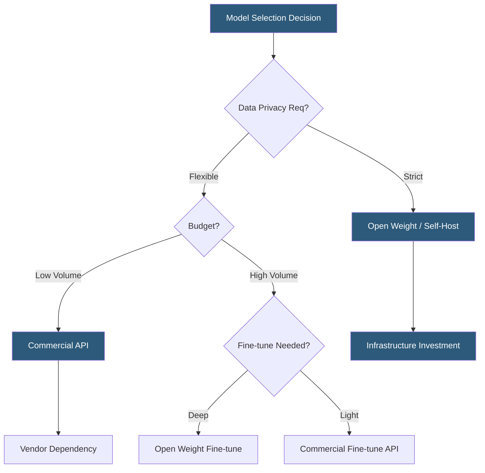

**Category:** AI Model Marketplaces
**Difficulty:** Intermediate
**Reading time:** 7 min read

---

The choice between commercial and open-source AI models involves fundamental trade-offs in capability, cost structure, data privacy, and operational control. Understanding the distinctions enables organizations to build AI strategies that balance short-term deployment velocity against long-term sovereignty and cost efficiency.

- **Frontier model** — state-of-the-art commercial models (GPT-4o, Claude 3.5 Sonnet, Gemini Ultra) maintained by large research labs with capabilities exceeding publicly available open models
- **Open-weight model** — model with publicly released weights that can be downloaded, self-hosted, and fine-tuned (Llama 3, Mistral, Falcon)
- **Open-source model** — model with both weights and training code released under OSI-compliant licenses; fewer models qualify under strict OSI definition
- **Inference cost** — per-token or per-request pricing for API-based commercial models versus compute cost for self-hosted open models
- **Data privacy** — commercial API calls send data to vendor servers; self-hosted open models keep data on-premises or in private cloud
- **Fine-tuning access** — commercial models typically offer restricted fine-tuning through vendor APIs; open models allow arbitrary fine-tuning including full weight updates
- **Support SLA** — commercial vendors provide enterprise support agreements; open models rely on community maintenance

Commercial models like those from Anthropic, OpenAI, and Google are accessed exclusively through managed APIs. The vendor handles training, infrastructure, safety fine-tuning, and ongoing model maintenance. Users pay per token consumed, with pricing tiers reflecting model capability levels. The primary advantages are zero infrastructure overhead, access to frontier capabilities, and enterprise SLAs with uptime guarantees. The costs are vendor lock-in, per-token economics that become expensive at scale, and data leaving the organization's control with every API call.

Open-weight models like Meta's Llama 3 family, Mistral AI's models, and the Falcon series are downloadable from repositories including Hugging Face, Ollama, and vendor sites. Self-hosting requires GPU infrastructure—typically one or more NVIDIA A10G, A100, or H100 GPUs depending on model size. A 70B parameter model requires approximately 40GB of GPU memory at FP16 precision, fitting on two A100 80GB GPUs. Quantization techniques (GGUF, AWQ, GPTQ) can compress models to run on 24GB consumer GPUs with modest quality degradation.

The economics typically favor commercial APIs at low request volumes and open hosting at high volumes. A rough crossover point often falls in the range of several million tokens per day, though this shifts continuously as GPU spot pricing and commercial API pricing evolve.

Hybrid strategies are increasingly common: frontier commercial models handle the most complex requests where capability differentials justify the cost, while open models serve high-volume routine tasks. Routing logic based on request complexity or confidence thresholds distributes traffic between the two tiers.

- Healthcare organizations using open models hosted in private cloud to avoid PHI exposure to vendor APIs
- Startups beginning with commercial APIs for velocity, then migrating to open models as volume grows
- Fine-tuning Llama for a proprietary domain where the fine-tuned model itself is a competitive asset
- Academic institutions using open models to ensure research reproducibility without API availability dependencies
- Enterprises running both commercial and open models as a resilience strategy against vendor outages

| Advantage | Disadvantage |
|-----------|--------------|
| Commercial: zero infrastructure overhead and frontier capability access | Commercial: data privacy exposure and vendor lock-in risk |
| Open: full data sovereignty and customization freedom | Open: requires GPU infrastructure investment and MLOps expertise |
| Commercial: rapid time-to-deployment with enterprise SLAs | Commercial: cost scales linearly with token volume |
| Open: fine-tuning produces proprietary model assets | Open: community maintenance may lag commercial model safety updates |

- [Pre-trained Model Licensing](pre-trained-model-licensing.md)
- [Model Usage Terms](model-usage-terms.md)
- [Model Performance Benchmarks](model-performance-benchmarks.md)

---
*Part of the [AI Model Marketplaces](index.md) category · [Back to Master Index](../../index.md)*
