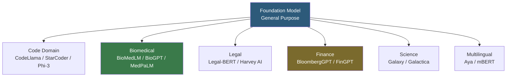

**Category:** AI Model Marketplaces
**Difficulty:** Intermediate
**Reading time:** 6 min read

---

Domain-specific model collections are curated sets of AI models trained or fine-tuned for particular industries or knowledge domains such as medicine, law, finance, biology, or code. They exist because general-purpose foundation models often underperform on specialized terminology, reasoning patterns, and compliance requirements found in vertical industries.

- **Domain pretraining** — training a model from scratch (or continued pretraining of a base model) on domain-specific corpora, embedding domain knowledge into the model's weights
- **BioMedLM** — a GPT-2 scale model pretrained on PubMed abstracts and PMC full-text articles, exemplifying biomedical domain specialization
- **CodeLlama** — Meta's code-specialized fine-tune of Llama 2, trained on a code-heavy corpus for programming task performance
- **Legal-BERT** — a BERT model fine-tuned on legal corpus, demonstrating the value of specialized tokenization for legal language
- **Medical terminology alignment** — the challenge that medical terms (e.g., "CAD" = coronary artery disease, not computer-aided design) require domain training for disambiguation
- **Regulatory compliance** — domain models for healthcare (HIPAA) and finance (SOC 2, FINRA) may need validation against regulatory frameworks before production use

Domain specialization is achieved through two mechanisms: corpus composition and training strategy. Domain-pretrained models (like BloombergGPT for finance, trained on 363 billion financial text tokens) update all model weights on a curated domain corpus, deeply ingraining domain vocabulary, reasoning patterns, and factual associations. This requires significant compute but produces models with robust domain understanding.

Domain fine-tuned models (like CodeLlama) start from a general base model and continue training on domain data. The base model's general language capabilities are preserved while domain-specific patterns are reinforced. This is more compute-efficient than full pretraining but may not achieve the same depth of domain integration.

Collections on platforms like Hugging Face Hub are organized through the `pipeline_tag`, `language`, and custom tag metadata fields. For example, filtering Hub by `medical` and `text-generation` returns models including ClinicalBERT, BioMedLM, and various Llama fine-tunes on PubMed data.

Evaluation of domain models is task-specific: biomedical models are benchmarked on MedQA and PubMedQA; code models on HumanEval and MBPP; legal models on CUAD (contract understanding); financial models on FPB (financial phrase bank) sentiment analysis. General benchmarks like MMLU have domain subsets that provide partial signal.

- Using BloombergGPT for financial news summarization to outperform general LLMs on finance-specific terminology
- Deploying CodeLlama in an IDE assistant for Python autocompletion with better in-context learning on code
- Using ClinicalBERT for named entity recognition of medical terms in clinical notes
- Selecting a legal fine-tuned Llama variant for contract clause extraction to reduce ambiguity in legal text

| Advantage | Disadvantage |
|-----------|--------------|
| Domain-specific training improves performance on specialized terminology and reasoning | Models may degrade on out-of-domain tasks; worse at general question answering |
| Smaller domain models often match or beat larger general models at lower inference cost | Domain model training requires curating large high-quality domain corpora |
| Domain-specific evaluation benchmarks enable meaningful performance comparisons | Proprietary commercial domain models (Harvey, Nuance) provide no weight access for inspection |

- [Fine-tuned Model Marketplaces](fine-tuned-model-marketplaces.md)
- [Pre-trained Model Licensing](pre-trained-model-licensing.md)
- [Model Performance Benchmarks](model-performance-benchmarks.md)

---
*Part of the [AI Model Marketplaces](index.md) category · [Back to Master Index](../../index.md)*
