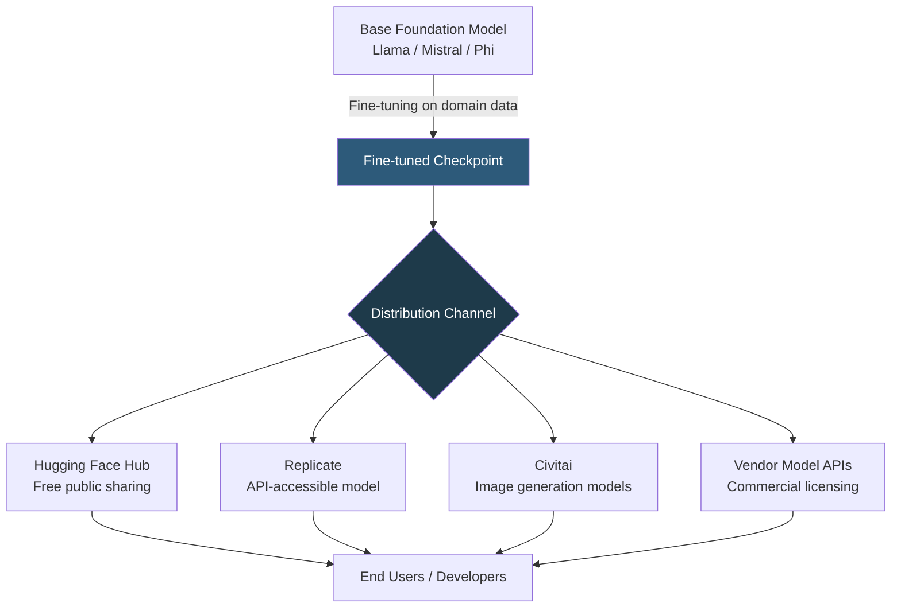

**Category:** AI Model Marketplaces
**Difficulty:** Intermediate
**Reading time:** 6 min read

---

Fine-tuned model marketplaces are platforms where pre-adapted versions of foundation models — trained on domain-specific data to improve performance on particular tasks — are distributed for purchase or free use. They bridge the gap between generic foundation models and fully custom-trained models, offering practitioners task-specific performance without the cost of training from scratch.

- **Fine-tuning** — the process of continuing training a pretrained model on a domain-specific dataset, adjusting weights to improve task performance
- **LoRA (Low-Rank Adaptation)** — a parameter-efficient fine-tuning method that trains small adapter matrices instead of the full model, reducing storage to megabytes rather than gigabytes
- **Domain-specific model** — a fine-tuned model adapted for a vertical like medicine, law, finance, or code generation
- **Adapter merge** — combining a LoRA adapter with the base model weights to produce a standalone, distributable checkpoint
- **Model zoo** — a curated collection of fine-tuned model variants organized by task and domain
- **License inheritance** — the constraint that a fine-tuned model inherits usage restrictions from its base model's license

Fine-tuned models are distributed through the same infrastructure as base models (Git-LFS-backed repositories, API endpoints), but carry additional provenance metadata linking them to their base model and training dataset. On Hugging Face Hub, the `base_model` metadata field in a model card creates a visible ancestry chain from fine-tuned model back to the foundation model.

Full fine-tunes (all weights updated) distribute as complete checkpoint files ranging from hundreds of MB to hundreds of GB. LoRA fine-tunes distribute as small adapter files (typically 10–300 MB) that require the base model for inference — the adapter modifies attention projection matrices at runtime via additive decomposition.

Quality signals for fine-tuned marketplace models include: benchmark scores on domain-specific evaluation sets, training data description (data source, size, cleaning methodology), and community download counts and ratings. The absence of these signals is itself informative — undocumented fine-tunes carry significant uncertainty about behavior on edge cases.

Commercial fine-tuned models (e.g., specialized legal LLMs from Harvey AI or medical AI from Nuance) are sold as API access rather than downloadable weights, protecting the fine-tuning data and process as trade secrets while still allowing customers to benefit from domain adaptation.

- Using a medically fine-tuned Llama 3 model for clinical note summarization to improve over generic GPT-4
- Deploying a code-specialized fine-tune for an IDE assistant that outperforms base models on Python completion
- Building a legal contract analyzer using a fine-tuned model trained on legal precedents
- Sharing a customer support fine-tune on Hugging Face Hub to enable other companies to adapt it to their domain

| Advantage | Disadvantage |
|-----------|--------------|
| Domain-adapted models often outperform larger general models on specific tasks | Fine-tuned model may overfit to training domain, degrading performance on out-of-domain inputs |
| LoRA distribution is storage-efficient; adapters are orders of magnitude smaller than full checkpoints | LoRA requires users to also download and manage the base model |
| Provenance metadata enables license compliance checking | License inheritance from base models can restrict commercial use even of entirely new fine-tunes |

- [Hugging Face Model Hub](hugging-face-model-hub.md)
- [Pre-trained Model Licensing](pre-trained-model-licensing.md)
- [Domain-specific Model Collections](domain-specific-model-collections.md)

---
*Part of the [AI Model Marketplaces](index.md) category · [Back to Master Index](../../index.md)*
