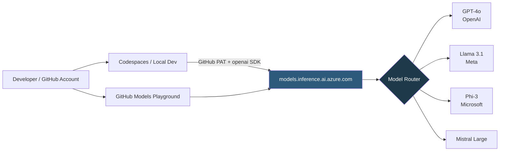

**Category:** AI Model Marketplaces
**Difficulty:** Beginner
**Reading time:** 5 min read

---

GitHub Models is a feature within GitHub that provides developers access to a curated set of AI foundation models through a playground and API, integrated directly into the GitHub developer experience. It enables developers to experiment with and integrate models from providers like OpenAI, Meta, Mistral, and Microsoft without leaving the GitHub ecosystem.

- **Model playground** — GitHub's browser-based interface for testing model responses with configurable parameters (temperature, max tokens, system prompt)
- **GitHub token authentication** — GitHub Models uses a personal access token (PAT) for authentication, making it immediately accessible to any GitHub account holder
- **OpenAI-compatible endpoint** — GitHub Models exposes a `https://models.inference.ai.azure.com` endpoint using the OpenAI SDK's schema
- **Rate limiting** — free tier includes generous daily request and token limits per model; higher tiers available for production use
- **Model catalog** — GitHub's curated list of models including GPT-4o, Llama 3.1, Phi-3, Mistral Large, and Cohere Command R+
- **Codespaces integration** — GitHub Models works natively in Codespaces with the GitHub token pre-configured as an environment variable

GitHub Models is backed by Azure AI's model inference infrastructure, which explains the `models.inference.ai.azure.com` endpoint URL. Authentication uses a GitHub Personal Access Token (PAT) rather than a separate API key, meaning any developer with a GitHub account can start making API calls immediately by setting `GITHUB_TOKEN` as the `api_key` parameter in the OpenAI SDK.

The OpenAI SDK compatibility means existing code written for OpenAI can switch to GitHub Models by changing three lines: the `base_url`, the `api_key`, and the `model` string. This makes GitHub Models an effective first step for developers prototyping with AI before committing to a paid API plan.

The playground interface allows non-developers to experiment with models, adjust parameters (system prompt, temperature, top-p, max tokens), and compare outputs. The "View code" button generates the Python, JavaScript, or C# snippet to reproduce the same call programmatically.

The free tier offers rate limits sufficient for development and prototyping (typically hundreds of requests per day per model). Production use at scale requires switching to the model provider's native API or Azure AI deployments. GitHub intends Models as a developer discovery and experimentation layer rather than a production inference service.

- Testing how GPT-4o handles a specific prompt before committing to OpenAI's paid API
- Prototyping an AI feature in a Codespaces environment using the pre-authenticated GitHub token
- Comparing Llama 3.1 70B versus Mistral Large responses side-by-side in the playground
- Generating a starter code snippet from the playground and pasting it directly into a repository

| Advantage | Disadvantage |
|-----------|--------------|
| No separate API key needed; GitHub PAT provides instant access for any developer | Free tier rate limits make it unsuitable for production-scale workloads |
| OpenAI-compatible endpoint reduces migration effort when switching to production APIs | Catalog is curated and smaller than dedicated marketplaces like Hugging Face or Together.ai |
| Direct integration with GitHub Codespaces simplifies AI-enabled development environments | Endpoint is Azure-backed; advanced Azure features (VNet, compliance) require Azure AI accounts |

- [Hugging Face Model Hub](hugging-face-model-hub.md)
- [OpenAI Model Marketplace](openai-model-marketplace.md)
- [Model Comparison Tools](model-comparison-tools.md)

---
*Part of the [AI Model Marketplaces](index.md) category · [Back to Master Index](../../index.md)*
