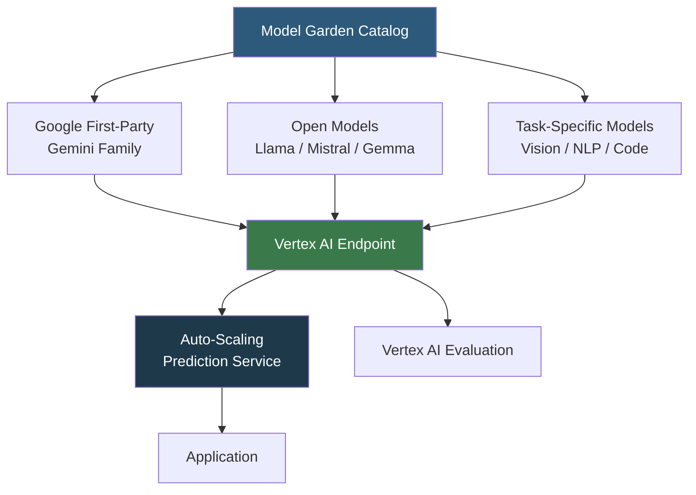

**Category:** AI Model Marketplaces
**Difficulty:** Intermediate
**Reading time:** 6 min read

---

Google Model Garden is a centralized catalog within Google Cloud Vertex AI that provides access to Google's first-party models (Gemini family), third-party open models, and task-specific fine-tuned variants. It enables enterprise users to discover, evaluate, and deploy AI models directly into Google Cloud infrastructure with built-in MLOps integration.

- **Vertex AI** — Google Cloud's unified ML platform that hosts Model Garden and provides training, evaluation, and serving infrastructure
- **Gemini family** — Google's flagship multimodal model lineup (Gemini Ultra, Pro, Flash, Nano) accessible through Model Garden
- **Model deployment** — the act of instantiating a Model Garden model as an Endpoint in Vertex AI, creating a REST-accessible prediction service
- **Model evaluation** — Vertex AI's built-in pipeline for running benchmark datasets against a deployed model and recording metrics
- **Partner models** — third-party models (e.g., Llama, Mistral, Falcon) hosted by Google with Vertex AI integration for authentication and billing
- **One-click deploy** — Model Garden's UI workflow that creates a Vertex AI Endpoint with optimal hardware and scaling configuration in minutes

Model Garden integrates with Vertex AI's serving infrastructure. When a user selects a model and clicks "Deploy," Vertex AI creates a Model resource (containing the serving container image and model artifacts), registers it to an Endpoint (the load-balanced prediction service), and provisions the specified machine type (e.g., `n1-standard-8` with NVIDIA T4 or `a2-highgpu-1g` with A100).

Gemini models are served via the Generative AI API within Vertex, which handles authentication through Google Cloud's IAM, supports VPC Service Controls for data residency, and provides audit logging via Cloud Audit Logs. This enterprise integration is a key differentiator from direct API access through Google AI Studio.

Open-weight models (Llama, Mistral, Falcon) run as containerized workloads on Vertex AI, with Google managing the serving infrastructure. Partner models use Vertex's One-Click Deploy, which pre-configures optimal instance types and serving containers for each model architecture.

Model evaluation in Garden uses Vertex AI Pipelines to run a model against benchmark datasets (e.g., MMLU, HumanEval) and store results in Cloud Storage, with metrics visualized in the Vertex AI UI. This allows direct comparison between model versions or different models from the catalog.

- Deploying Gemini Pro for an enterprise chatbot with GCP IAM access control and VPC isolation
- Comparing Llama 3 70B against Gemini Flash for a cost/quality tradeoff analysis
- Fine-tuning Gemma on proprietary documents using Vertex AI supervised tuning
- Running MMLU benchmarks against multiple Model Garden models to select a candidate for production

| Advantage | Disadvantage |
|-----------|--------------|
| Native GCP IAM integration enables enterprise-grade access control | Vendor lock-in to Google Cloud for deployment infrastructure |
| VPC Service Controls satisfy strict data residency and isolation requirements | One-click deployed endpoints can be expensive; requires careful auto-scaling configuration |
| Unified billing through Google Cloud simplifies cost attribution | Open model selection smaller than Hugging Face Hub; newer models arrive with lag |

- [AWS Marketplace ML Models](aws-marketplace-ml-models.md)
- [Azure AI Model Catalog](azure-ai-model-catalog.md)
- [Model Performance Benchmarks](model-performance-benchmarks.md)

---
*Part of the [AI Model Marketplaces](index.md) category · [Back to Master Index](../../index.md)*
