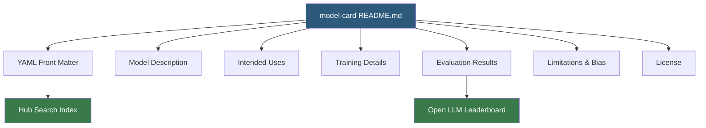

**Category:** AI Model Marketplaces
**Difficulty:** Beginner
**Reading time:** 5 min read

---

Model cards are standardized documentation files that accompany machine learning models, describing their intended use, training details, evaluation metrics, limitations, and ethical considerations. Pioneered by Google researchers and operationalized by Hugging Face, model cards have become the industry standard for communicating what a model does and does not do.

- **Model card** — a Markdown README.md file in a Hub repository that follows a structured metadata schema
- **YAML front matter** — structured metadata at the top of a model card (language, license, tags, metrics) parsed by the Hub to populate filters and leaderboards
- **Bias and limitations section** — a required documentation block disclosing known failure modes and demographic performance gaps
- **Evaluation results** — quantitative benchmark scores linked to specific datasets and metrics
- **License field** — machine-readable SPDX identifier (e.g., `apache-2.0`, `llama3`) governing redistribution rights
- **Widget** — an interactive demo embedded in the model card powered by the Inference API

A model card lives as `README.md` in the root of a Hub repository. The YAML front matter block between `---` delimiters is parsed by the Hub API to populate searchable metadata: language codes (ISO 639-1), task tags (e.g., `text-classification`, `image-segmentation`), dataset names linked to the Hub Datasets catalog, metric values, and the license identifier.

The Hub renders the Markdown body with extended components: collapsible sections, embedded Spaces iframes for live demos, and auto-linked cross-references to datasets and other models. When `model-index` YAML is present with benchmark results, those scores are automatically ingested into relevant leaderboards such as the Open LLM Leaderboard.

The `huggingface_hub` library provides `ModelCard.load()` and `ModelCard.push_to_hub()` for programmatic generation. Tools like `evaluate` can auto-generate the evaluation section after running benchmarks. The Hub linter checks for missing required sections and warns if no license is specified. Enterprise Hub deployments can enforce custom card templates via organization-level policies.

- Compliance teams reviewing a model's data provenance before production deployment
- Researchers comparing benchmark scores across model families on the Open LLM Leaderboard
- Platform engineers filtering Hub search by license to find permissively licensed models
- ML engineers auto-generating model cards from training logs using the `evaluate` library

| Advantage | Disadvantage |
|-----------|--------------|
| Standardized format enables automated parsing and leaderboard integration | Authors may omit or underreport limitations, biases, and failure modes |
| Machine-readable YAML front matter powers Hub search filters | No enforcement mechanism to verify claimed benchmark scores |
| Community can flag inaccurate or harmful cards via discussions | Format evolves over time, making older cards inconsistent |

- [Hugging Face Model Hub](hugging-face-model-hub.md)
- [Model Bias Documentation](model-bias-documentation.md)
- [Pre-trained Model Licensing](pre-trained-model-licensing.md)

---
*Part of the [AI Model Marketplaces](index.md) category · [Back to Master Index](../../index.md)*
