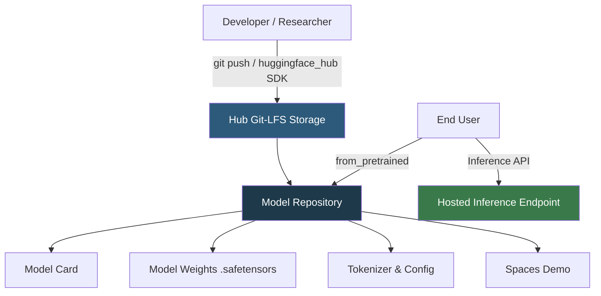

**Category:** AI Model Marketplaces
**Difficulty:** Beginner
**Reading time:** 6 min read

---

Hugging Face Model Hub is the world's largest open-source AI model repository, hosting over 500,000 models across NLP, vision, audio, and multimodal domains. It serves as the central distribution point for state-of-the-art pretrained models, enabling researchers and engineers to discover, share, and deploy models without training from scratch.

- **Model card** — a structured README document accompanying every model that describes its intended use, training data, evaluation results, and ethical considerations
- **Repository** — a Git-LFS-backed storage unit on Hub that holds model weights, configuration files, and tokenizer assets
- **Pipeline** — Hugging Face's high-level inference API that abstracts model loading into a single function call
- **Spaces** — hosted demo environments (Gradio or Streamlit) linked to Hub models for live interactive testing
- **Safetensors** — a safe, fast model serialization format that replaces pickle-based `.bin` files
- **Gated model** — a repository requiring user agreement to usage terms before downloading weights

When a model is pushed to Hugging Face Hub, Git LFS (Large File Storage) handles the large binary weight files while standard Git tracks configuration, tokenizer files, and metadata. The `huggingface_hub` Python library communicates with the Hub API to authenticate users, create repositories, and upload/download files using chunked resumable transfers.

The `from_pretrained()` method in Transformers first checks a local cache directory (`~/.cache/huggingface/hub`); if the model is not cached, it resolves the model ID to a repository URL, fetches the `config.json` to determine the architecture class, then downloads weights using the Hub CDN backed by Cloudflare. Models over a few GB are served in sharded files (e.g., `model-00001-of-00003.safetensors`).

Access control is layered: public models require no authentication; gated models (e.g., Llama 3, Gemma) require Hub account login and explicit terms acceptance; private models require an access token with read permissions. The Hub also runs automated safety scanning that flags malicious pickle exploits in `.bin` files, which is why Safetensors adoption has accelerated.

The Inference API provides serverless, pay-per-call access to any publicly hosted model, routing requests to a shared GPU fleet. For dedicated throughput, Inference Endpoints provisions single-tenant containers on AWS, Azure, or GCP.

- Downloading a pretrained BERT model to fine-tune on a custom classification dataset
- Publishing a fine-tuned medical NLP model for community reuse with a detailed model card
- Running zero-shot inference via the hosted API without GPU infrastructure
- Browsing leaderboards to select the best open-weight LLM for a RAG application

| Advantage | Disadvantage |
|-----------|--------------|
| Largest open-model ecosystem with 500k+ models | Large model downloads can be slow without regional mirrors |
| Free hosting for public models with CDN distribution | Private model hosting requires paid Pro or Enterprise plan |
| Native Transformers and Diffusers integration | Git LFS history can make repos large and slow to clone |
| Community model cards provide bias/safety transparency | Model quality varies widely; no universal vetting process |

- [Hugging Face Model Cards](hugging-face-model-cards.md)
- [Fine-tuned Model Marketplaces](fine-tuned-model-marketplaces.md)
- [Model Search and Discovery](model-search-and-discovery.md)

---
*Part of the [AI Model Marketplaces](index.md) category · [Back to Master Index](../../index.md)*
