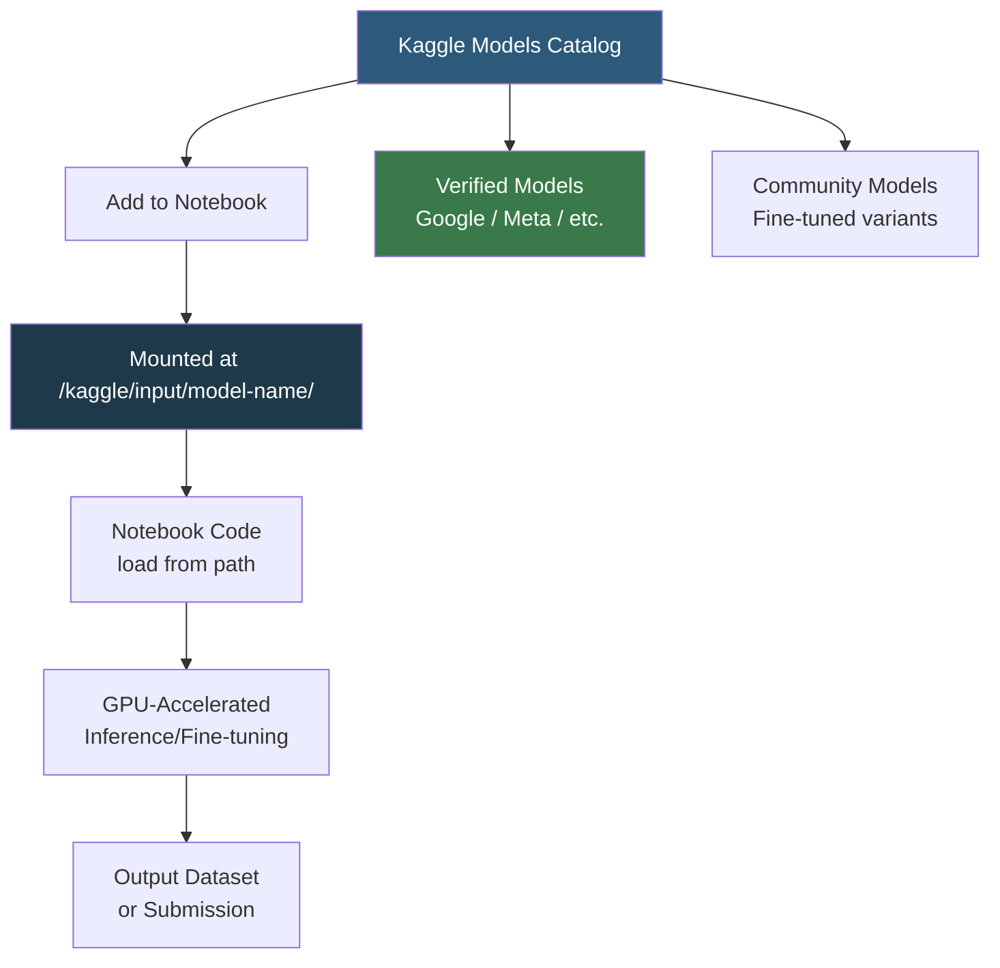

**Category:** AI Model Marketplaces
**Difficulty:** Beginner
**Reading time:** 5 min read

---

Kaggle Models is a model repository integrated into Google's Kaggle data science platform, providing a curated collection of pretrained models optimized for use within Kaggle Notebooks. It lowers the barrier to entry for ML practitioners by offering models as dataset-like resources that can be loaded into notebooks without managing downloads or storage.

- **Kaggle Notebook** — a cloud-hosted Jupyter environment with free GPU/TPU access where Kaggle Models can be mounted as read-only volumes
- **Model variation** — a specific configuration of a model (e.g., a particular parameter count or fine-tuned variant) within a model framework on Kaggle
- **Model framework** — a grouping within a Kaggle model entry (e.g., PyTorch, TensorFlow, JAX) that distinguishes format variants of the same architecture
- **Model mounting** — attaching a Kaggle model to a notebook session, making its files accessible at a predictable filesystem path (`/kaggle/input/`)
- **Kaggle competition integration** — models can be shared and reused across competition submissions, enabling collaborative fine-tuning workflows
- **Verified model** — a Kaggle badge indicating the model was uploaded by the official owner (e.g., Google's Gemma, Meta's Llama)

Kaggle Models stores model files in Google Cloud Storage and mounts them into notebook containers via a FUSE filesystem. When a user adds a model to their notebook, the files appear at `/kaggle/input/<model-slug>/` and are accessible like local files with near-zero latency within Kaggle's Google Cloud infrastructure.

Users can upload their own models through the Kaggle UI or CLI (`kaggle models versions create`), specifying a framework (PyTorch, TensorFlow, JAX, Transformers) and uploading weight files. Public models are accessible to all Kaggle users; private models are restricted to the uploader's account or team.

Verified models are official uploads from the model's creators, often cross-posted from Hugging Face Hub. These include Gemma (Google), Llama 3 (Meta), Mistral, Stable Diffusion, and competition-specific pretrained baselines. Having the weights pre-mounted eliminates the download time that would normally consume competition session hours.

The Kaggle API (`kaggle models get`) allows programmatic access to model metadata and download URLs for use outside of notebooks, though weights are typically more conveniently accessed via Hugging Face Hub for non-Kaggle workflows.

- Loading Gemma 7B in a Kaggle Notebook without consuming session time downloading weights
- Publishing a competition-winning fine-tuned model for community reuse
- Comparing multiple pretrained baselines on a competition dataset using pre-mounted model variations
- Accessing gated models (Llama, Gemma) that require terms acceptance, which Kaggle handles through its integration

| Advantage | Disadvantage |
|-----------|--------------|
| Zero-download model access within Kaggle Notebooks saves session time | Model files are only conveniently accessible within Kaggle infrastructure |
| Free GPU hours for training/inference with pre-mounted models | Model catalog is smaller than Hugging Face Hub; community uploads may lack documentation |
| Verified models from official providers carry trust and quality assurance | Limited versioning controls; older model versions can be difficult to pin |

- [Papers with Code Models](papers-with-code-models.md)
- [Hugging Face Model Hub](hugging-face-model-hub.md)
- [Model Versioning in Marketplaces](model-versioning-in-marketplaces.md)

---
*Part of the [AI Model Marketplaces](index.md) category · [Back to Master Index](../../index.md)*
