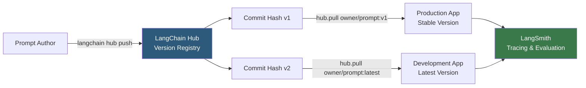

**Category:** AI Model Marketplaces
**Difficulty:** Intermediate
**Reading time:** 5 min read

---

LangChain Hub is a repository for sharing and discovering reusable LangChain prompt templates, chains, and agents. It enables teams to version-control, share, and pull prompt components programmatically, treating prompts as first-class versioned artifacts rather than strings embedded in application code.

- **Hub prompt** — a versioned prompt template stored on LangChain Hub, accessible via `hub.pull("owner/prompt-name")`
- **LangSmith** — LangChain's observability platform that integrates with Hub for prompt versioning, A/B testing, and tracing
- **PromptTemplate** — LangChain's abstraction for parameterized prompts with named input variables filled at runtime
- **ChatPromptTemplate** — a LangChain prompt object composed of system, human, and AI message templates for chat models
- **Commit hash** — an immutable reference to a specific prompt version on Hub, enabling reproducible deployments
- **Prompt versioning** — Hub's tracking of prompt changes over time with the ability to roll back or compare versions

LangChain Hub uses the LangSmith backend for storage and authentication. Pushing a prompt requires a LangSmith API key: `hub.push("owner/my-prompt", prompt_template)`. This serializes the prompt object (including template variables, format instructions, and message roles) to Hub's registry and creates a new commit.

Pulling prompts in application code uses `hub.pull("owner/my-prompt")` which downloads and deserializes the latest version, or `hub.pull("owner/my-prompt:abc123")` for a specific commit hash. This separates prompt iteration from code deployments — a prompt engineer can update prompts in Hub without touching application code.

Hub integrates with LangSmith's A/B testing feature: two prompt versions can be routed to different traffic percentages, with LangSmith tracking performance metrics (response quality scores, user feedback) per version. This enables data-driven prompt optimization without code changes.

Public Hub prompts can be browsed at smith.langchain.com/hub. The catalog includes community-contributed prompts for common tasks (RAG Q&A, code explanation, entity extraction) as well as LangChain's own reference implementations.

- Centralizing prompt templates for a team so all developers pull from the same versioned source
- Enabling a prompt engineer to iterate on prompts without requiring engineering deployments
- A/B testing two variants of a RAG retrieval prompt to measure which produces higher user satisfaction
- Pulling a community-contributed SQL generation prompt as a starting point for a text-to-SQL feature

| Advantage | Disadvantage |
|-----------|--------------|
| Version-controlled prompts decouple prompt iteration from code releases | Requires LangSmith account; public prompts have limited discovery features |
| Commit hash pinning ensures production stability while enabling experimentation | LangChain-specific; prompts require adaptation to use with non-LangChain inference code |
| A/B testing integration enables data-driven prompt optimization | Community catalog is smaller and less curated than general prompt marketplaces |

- [Anthropic Prompt Library](anthropic-prompt-library.md)
- [OpenAI Cookbook Recipes](openai-cookbook-recipes.md)
- [LlamaIndex Data Connectors](llamaindex-data-connectors.md)

---
*Part of the [AI Model Marketplaces](index.md) category · [Back to Master Index](../../index.md)*
