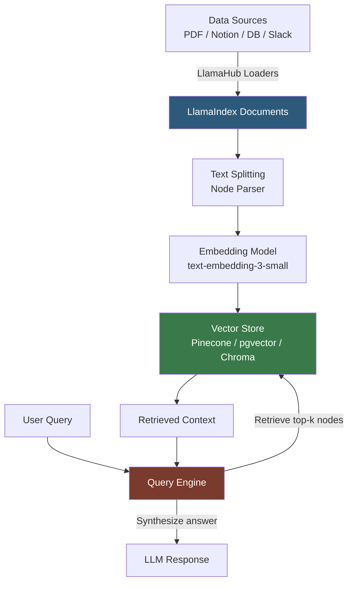

**Category:** AI Model Marketplaces
**Difficulty:** Intermediate
**Reading time:** 6 min read

---

LlamaIndex (formerly GPT Index) provides a library of data connectors (called LlamaHub) that standardize ingestion of diverse data sources into vector stores for RAG applications. LlamaHub functions as a marketplace of readers and loaders enabling connection to hundreds of data sources — from PDF files and databases to Notion, Slack, and GitHub — with a unified interface.

- **LlamaHub** — the community registry of data connectors, loaders, tools, and agent packs for LlamaIndex
- **Data loader / Reader** — a LlamaHub component that connects to a data source and returns `Document` objects for indexing
- **Document** — LlamaIndex's standardized unit for text content, carrying metadata and a text body
- **Vector store index** — a LlamaIndex index type that embeds documents and enables semantic similarity search at query time
- **Node** — a chunk of a Document after splitting; the unit stored in a vector index
- **Query engine** — a LlamaIndex abstraction that orchestrates retrieval and synthesis to answer questions over an index

LlamaHub connectors are Python packages installable via `pip install llama-index-readers-<source>`. Each reader implements a `load_data()` method that authenticates with the data source, fetches content, and returns a list of `Document` objects. Metadata (source URL, creation date, author) is attached to each document for filtering and attribution.

The standard RAG pipeline chains these components: loaders populate Documents, the `SentenceSplitter` or `TokenTextSplitter` splits them into appropriately sized Nodes (typically 256–512 tokens), an embedding model encodes each Node into a dense vector, and the vector store persists these embeddings with their text.

At query time, the query engine embeds the user's question, performs approximate nearest-neighbor (ANN) search in the vector store to retrieve top-k Nodes, assembles the retrieved text into a context window, and calls an LLM to synthesize an answer. The `response_mode` parameter controls synthesis strategy: `compact` packs maximum context, `refine` iteratively refines an answer over multiple retrieved chunks.

LlamaHub also hosts agent tools (wrappers for external APIs like Wikipedia, weather, or financial data) and agent packs (pre-built multi-step reasoning agents for common tasks). These components follow the same registry model — discoverable via llama-hub.github.io and installable as pip packages.

- Building a document Q&A system over a company's Confluence wiki using the Confluence reader
- Ingesting GitHub repository code and issues into a vector store for an AI code assistant
- Creating a Slack knowledge base RAG application using the Slack reader to index channel history
- Combining a Notion reader and a PDF reader to create a unified search over a team's knowledge base

| Advantage | Disadvantage |
|-----------|--------------|
| 300+ connectors cover most enterprise data sources out of the box | Community-maintained readers vary in quality; some have authentication edge cases |
| Standardized Document/Node abstraction makes swapping data sources straightforward | LlamaIndex's abstractions add conceptual overhead compared to direct vector store usage |
| Tight integration with major vector stores (Pinecone, Weaviate, Chroma, pgvector) | Complex pipelines with many components can be difficult to debug without LlamaIndex's tracing tools |

- [LangChain Hub](langchain-hub.md)
- [OpenAI Cookbook Recipes](openai-cookbook-recipes.md)
- [Fine-tuned Model Marketplaces](fine-tuned-model-marketplaces.md)

---
*Part of the [AI Model Marketplaces](index.md) category · [Back to Master Index](../../index.md)*
