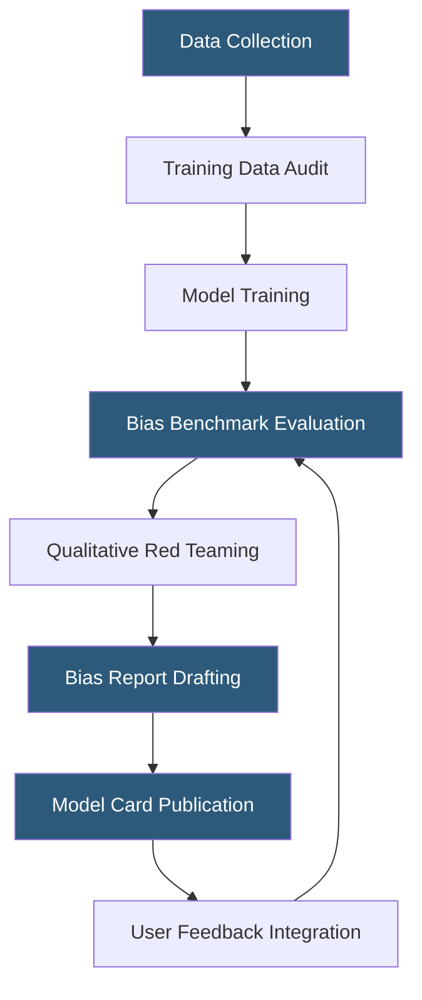

**Category:** AI Model Marketplaces
**Difficulty:** Intermediate
**Reading time:** 6 min read

---

Model bias documentation formally captures known demographic, linguistic, and contextual biases present in an AI model's training data and outputs. Well-structured bias documentation enables downstream users to assess whether a model is appropriate for their use case and implement mitigations when necessary.

- **Model card** — standardized documentation format (Mitchell et al., 2019) covering intended use, evaluation results, and known limitations including bias
- **Training data provenance** — disclosure of datasets used for pre-training and fine-tuning, which determines potential biases absorbed by the model
- **Demographic parity** — fairness metric requiring equal output quality or refusal rates across demographic groups
- **Counterfactual fairness** — testing whether model outputs change when demographic descriptors in prompts are swapped
- **Toxicity amplification** — phenomenon where models disproportionately generate negative associations with certain demographic groups
- **Language coverage gap** — degraded model performance on low-resource languages due to under-representation in training corpora
- **Intersectionality** — biases compounding at intersections of multiple demographic attributes (e.g., race × gender)

Bias documentation begins during the data curation phase, where teams audit training corpora for demographic representation imbalances, historical prejudices embedded in text, and geographic or cultural coverage gaps. Common training datasets (Common Crawl, C4, The Pile) are known to over-represent English, Western perspectives, and more recent time periods.

Post-training, developers evaluate bias using standardized benchmarks. WinoBias and WinoGender test gender pronoun coreference resolution. StereoSet measures stereotypical associations. BBQ (Bias Benchmark for QA) probes nine protected attribute categories across ambiguous and disambiguated contexts. Results are reported as absolute scores and deltas versus baseline.

Qualitative red teaming complements quantitative metrics—human evaluators probe the model using carefully crafted prompts targeting specific demographics, religions, professions, and political affiliations. Findings are compared against a harm taxonomy to assign severity levels.

Published bias documentation in model cards follows formats standardized by Hugging Face, Google (through model cards paper), and Meta (through the Llama model card series). Cards include intended use cases, out-of-scope uses, known biases with severity assessments, and recommended mitigations (post-processing classifiers, prompt engineering, or user-facing warnings). Marketplace platforms increasingly require bias documentation as a listing prerequisite for enterprise-tier models.

- Evaluating a hiring tool model for disparate impact on protected classes before EEOC-regulated deployment
- Academic research comparing bias profiles across model families
- Regulatory submissions demonstrating AI fairness compliance in financial services
- Developer selection of models for multilingual customer service applications
- Journalism using bias documentation to investigate AI vendor accountability

| Advantage | Disadvantage |
|-----------|--------------|
| Enables informed model selection for sensitive domains | Documentation can lag model updates, creating stale bias information |
| Creates accountability pressure on model developers to reduce bias | Quantitative benchmarks capture only a fraction of real-world bias |
| Helps downstream users implement appropriate mitigations | Overly detailed disclosures may deter adoption of otherwise useful models |
| Supports regulatory compliance in sectors with fairness mandates | Bias metrics can conflict—optimizing one may worsen another |

- [Model Safety Ratings](model-safety-ratings.md)
- [Model Performance Benchmarks](model-performance-benchmarks.md)
- [Model Usage Terms](model-usage-terms.md)

---
*Part of the [AI Model Marketplaces](index.md) category · [Back to Master Index](../../index.md)*
