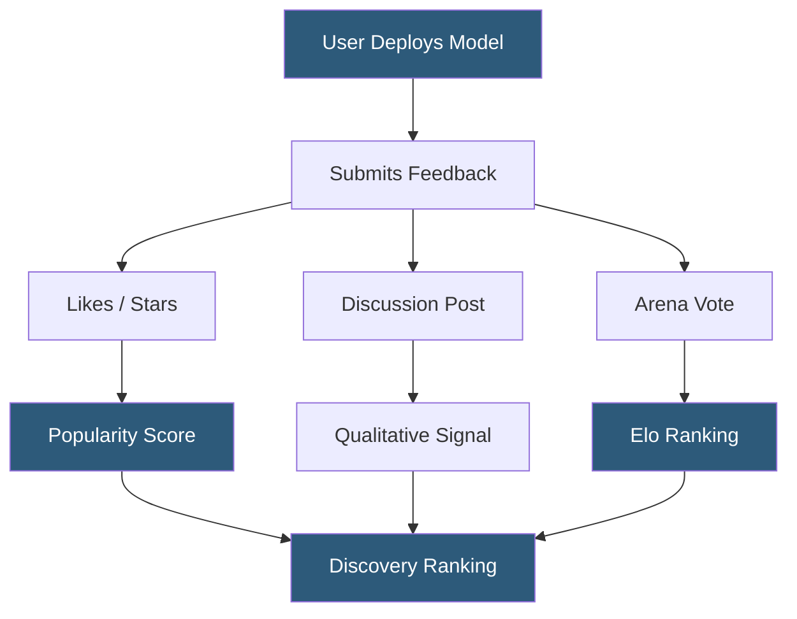

**Category:** AI Model Marketplaces
**Difficulty:** Beginner
**Reading time:** 5 min read

---

Model community ratings aggregate qualitative and quantitative feedback from practitioners who have deployed or tested AI models, providing a human-experience layer that complements automated benchmark scores. These ratings capture real-world utility, ease of integration, and output quality signals that formal evaluations often miss.

- **Likes and upvotes** — simple positive engagement signals that indicate community approval on platforms like Hugging Face
- **Discussion threads** — structured comment sections on model cards where users report issues, share use cases, and provide informal quality assessments
- **Arena Elo rating** — competitive ranking derived from pairwise human preference votes in blind comparison environments (LMSYS Chatbot Arena)
- **Star rating** — numerical quality score (typically 1-5) used in some marketplace platforms for quick quality signaling
- **Verified deployment badge** — indicator that a model has been successfully used in a verified production deployment
- **Task-specific community score** — rating filtered to users who applied the model for a particular task category
- **Issue tracker** — bug reporting mechanism on model repos where users document behavioral problems, bias occurrences, and integration failures

Hugging Face's community rating system centers on a "like" mechanism where authenticated users endorse models they find valuable. These likes aggregate into a public count displayed prominently on model cards and factored into search ranking. Discussion threads function as informal peer review—power users leave detailed notes about quirks, optimal prompting strategies, and observed failure modes that don't appear in official documentation.

LMSYS Chatbot Arena implements the most rigorous community rating system: users submit prompts and receive responses from two anonymous models, then vote on which response is better. Over millions of such votes, an Elo ranking emerges that is statistically robust and harder to manipulate than simple like counts. The arena leaderboard has become a widely cited external validity check for model developer benchmark claims.

Replicate combines community ratings with usage-based trust signals: models that have processed millions of predictions with low error rates receive a "featured" badge. This combines system reliability (few API errors) with community adoption into a composite trust indicator.

Commercial platforms like Scale AI's Spellbook and AWS SageMaker JumpStop incorporate internal customer rating mechanisms where enterprise users rate model quality on their specific use cases, feeding aggregated scores back to procurement teams across the organization.

Community rating quality varies significantly by model specialization: broad general-purpose models accumulate large rating samples quickly, while specialized domain models may have only dozens of raters, making statistical reliability lower.

- Reading discussion threads to discover known integration issues before committing engineering time
- Using Arena Elo rankings as a tiebreaker between models with similar benchmark scores
- Contributing ratings to improve discovery quality for the broader practitioner community
- Filtering model search by minimum like count to surface community-validated options
- Monitoring community discussions on a deployed model for emerging quality degradation reports

| Advantage | Disadvantage |
|-----------|--------------|
| Captures real-world usability issues that benchmarks miss | Like counts are easily gamed through coordinated upvoting |
| Arena ratings provide statistically robust human preference signal | Niche models receive too few community votes for reliable rating stability |
| Discussion threads surface integration tips and known failure modes | Community ratings reflect popular use cases, not the requester's specific task |
| Verified deployment badges add accountability to quality signals | Popular models attract disproportionate ratings, reinforcing incumbent advantage |

- [Model Download Statistics](model-download-statistics.md)
- [Model Comparison Tools](model-comparison-tools.md)
- [Commercial vs Open-Source Models](commercial-vs-open-source-models.md)

---
*Part of the [AI Model Marketplaces](index.md) category · [Back to Master Index](../../index.md)*
