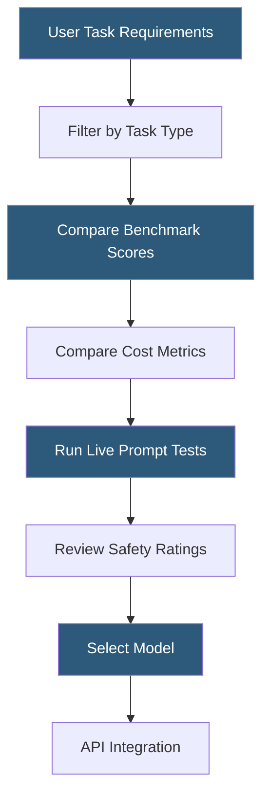

**Category:** AI Model Marketplaces
**Difficulty:** Beginner
**Reading time:** 5 min read

---

Model comparison tools provide side-by-side evaluation interfaces that help practitioners select the most suitable AI model for a given task. These tools range from hosted leaderboards and benchmark aggregators to interactive prompt playgrounds where users can evaluate responses in real time.

- **Arena-style comparison** — blind side-by-side evaluation where users vote on which model produced the better response without knowing model identity
- **Elo rating system** — competitive ranking algorithm borrowed from chess, used to rank models based on win/loss ratios across pairwise human preferences
- **Prompt playground** — interactive environment for submitting the same prompt to multiple models simultaneously and comparing outputs
- **Cost-per-token comparison** — pricing normalization across different model providers enabling cost-efficiency analysis
- **Latency benchmarking** — time-to-first-token and end-to-end response time measurement across models
- **Task-specific filtering** — comparison tool functionality that surfaces only models evaluated on a particular task category
- **Composite scoring** — weighted aggregation of multiple benchmark dimensions into a single comparable score

Model comparison tools aggregate data from multiple sources: official benchmark results from model developers, third-party independent evaluations, community-contributed test results, and live API performance measurements. Platforms like LMSYS Chatbot Arena collect millions of user preference votes, producing statistically robust Elo rankings that correlate well with human-perceived quality.

Commercial tools such as Artificial Analysis and Scale Leaderboard normalize pricing and latency data by testing models programmatically against standardized APIs. They report median latency, throughput (tokens/second), and cost per million tokens in a regularly updated database, enabling direct cost-performance optimization decisions.

Prompt playground interfaces (available on platforms including Together.ai, Fireworks.ai, and vendor consoles) allow users to submit the same prompt to multiple models and compare outputs interactively. This rapid iteration is particularly valuable for prompt engineers optimizing system prompt effectiveness across model families.

For fine-tuned or specialized models, comparison is more nuanced. Domain-specific test sets curated for legal, medical, or coding tasks provide more relevant signal than general benchmarks. Some marketplace platforms (Hugging Face Spaces, Replicate) host community-built comparison demos specifically for narrow task categories.

Enterprise comparison workflows typically combine automated benchmark data with internal human evaluation: a panel of domain experts rates model outputs on a scoring rubric calibrated to the organization's quality standards.

- Selecting a code generation model by comparing HumanEval scores alongside pricing
- Running blind A/B tests on customer-facing chatbot responses to determine model preference
- Tracking model performance regressions after a vendor updates their hosted model
- Justifying model vendor selection in procurement documentation
- Research comparing instruction-tuned variants of the same base model

| Advantage | Disadvantage |
|-----------|--------------|
| Centralizes diverse benchmark data into actionable decision interfaces | Published benchmark data can be stale relative to latest model versions |
| Arena-style human voting reduces benchmark gaming effects | Live API tests incur cost and may be affected by provider rate limits |
| Cost normalization enables ROI-based model selection | Composite scores obscure task-specific strengths and weaknesses |
| Prompt playground supports rapid iteration without engineering overhead | User preference votes in arenas may reflect response style over actual accuracy |

- [Model Performance Benchmarks](model-performance-benchmarks.md)
- [Model Search and Discovery](model-search-and-discovery.md)
- [Model Community Ratings](model-community-ratings.md)

---
*Part of the [AI Model Marketplaces](index.md) category · [Back to Master Index](../../index.md)*
