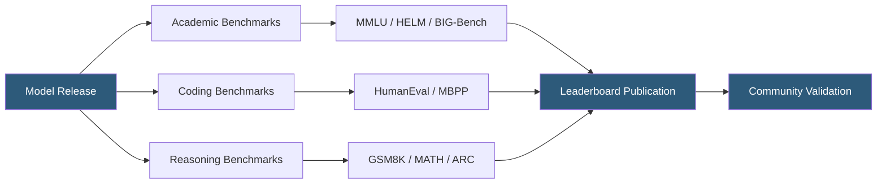

**Category:** AI Model Marketplaces
**Difficulty:** Intermediate
**Reading time:** 7 min read

---

Model performance benchmarks provide standardized, reproducible evaluations that allow objective comparison of AI models across task types, reasoning ability, and domain knowledge. Benchmark results published in model cards and marketplace listings directly influence model selection decisions for both research and production deployments.

- **MMLU (Massive Multitask Language Understanding)** — 57-subject academic benchmark testing knowledge breadth across STEM, humanities, and social sciences
- **HumanEval** — coding benchmark with 164 Python programming tasks measuring functional correctness via unit tests
- **HELM (Holistic Evaluation of Language Models)** — Stanford framework evaluating accuracy, calibration, robustness, fairness, and efficiency together
- **MT-Bench** — multi-turn conversation quality benchmark scored by GPT-4 as judge
- **Perplexity** — statistical measure of language model prediction quality on held-out text; lower is better
- **Throughput** — tokens generated per second under a standardized hardware and batch size configuration
- **Context window utilization** — performance on tasks requiring reasoning over long documents approaching the model's maximum context length

Benchmark evaluation follows a standardized protocol: the model receives prompts from a fixed evaluation set, generates outputs under controlled temperature settings (usually 0 for deterministic comparison), and results are scored by automated judge functions or secondary LLMs.

Academic benchmarks like MMLU present multiple-choice questions and measure accuracy as the fraction of correctly answered questions. Coding benchmarks like HumanEval run generated code against hidden test suites, reporting pass@k—the probability that at least one of k generated solutions passes all tests. Math benchmarks like GSM8K require multi-step arithmetic reasoning and report exact-match accuracy.

The Open LLM Leaderboard maintained by Hugging Face aggregates results across a standardized benchmark suite, enabling apples-to-apples comparison across models that researchers submit. However, benchmark saturation is a known problem: as models train on benchmark-adjacent data, scores inflate without corresponding real-world capability improvement.

LMSYS Chatbot Arena addresses this through Elo-rated human preference voting, where real users compare model outputs blind to model identity. This provides a complementary human-preference signal alongside automated metrics. For production deployment decisions, organizations increasingly run custom internal benchmarks calibrated to their specific task distributions rather than relying solely on published leaderboard scores.

Efficiency benchmarks (tokens/second, cost per million tokens, time-to-first-token) are critical for production selection and increasingly appear alongside quality metrics in marketplace listings.

- Selecting the best model within a cost budget for a customer support application
- Academic research comparing new model architectures against established baselines
- Vendor contract negotiations using independent benchmark data to justify pricing
- CI/CD pipeline integrating benchmark regression tests to detect model degradation after fine-tuning
- Enterprise procurement teams building model selection scorecards combining multiple benchmark dimensions

| Advantage | Disadvantage |
|-----------|--------------|
| Reproducible scores enable objective model comparison | Benchmark contamination inflates scores when test data leaks into training |
| Wide adoption creates community consensus on capability rankings | Automated benchmarks may not reflect task-specific production performance |
| Efficiency benchmarks enable cost-performance optimization | Leaderboard optimization can lead to "teaching to the test" model development |
| Multi-dimensional frameworks (HELM) capture quality, safety, and efficiency together | Benchmark maintenance lags emergence of new model capabilities |

- [Model Comparison Tools](model-comparison-tools.md)
- [Model Safety Ratings](model-safety-ratings.md)
- [Model Bias Documentation](model-bias-documentation.md)

---
*Part of the [AI Model Marketplaces](index.md) category · [Back to Master Index](../../index.md)*
