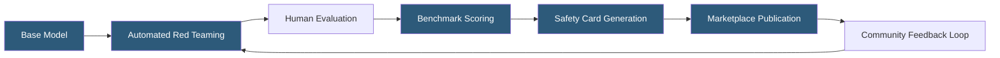

**Category:** AI Model Marketplaces
**Difficulty:** Intermediate
**Reading time:** 6 min read

---

Model safety ratings provide standardized assessments of an AI model's propensity to generate harmful, biased, or policy-violating outputs. These ratings help organizations select models appropriate for their risk tolerance and regulatory environment, and they form the foundation of responsible AI procurement decisions.

- **Red teaming** — structured adversarial testing to elicit harmful outputs before public release
- **Harm taxonomy** — categorization of potential harms (CSAM, violence, misinformation, PII leakage, etc.) used to define safety evaluation scope
- **Refusal rate** — percentage of harmful prompts the model correctly declines versus complies with
- **False positive rate** — frequency with which a model refuses legitimate benign requests due to over-restriction
- **Constitutional AI** — Anthropic's training approach encoding model behavior rules through self-critique and revision
- **RLHF safety fine-tuning** — Reinforcement Learning from Human Feedback applied specifically to reduce harmful outputs
- **Benchmark suite** — standardized evaluation datasets (TruthfulQA, BBQ, AdvBench) used to compare safety across models

Safety rating systems operate at multiple stages of the model development lifecycle. During pre-release, model developers conduct red teaming sessions where both automated tools and human specialists attempt to elicit harmful outputs across defined harm categories. Results feed into safety fine-tuning iterations—often using RLHF with specifically trained reward models that score outputs for harm.

Post-fine-tuning, models are evaluated against standardized benchmarks. TruthfulQA measures tendency to hallucinate false facts. BBQ (Bias Benchmark for QA) probes demographic biases. AdvBench tests resistance to adversarial jailbreak prompts. These scores are published on model cards (Hugging Face's standard format) alongside methodology disclosures.

Marketplace platforms layer their own safety filters atop model-provided safeguards. Replicate, for instance, runs outputs through content classifiers before returning them to callers. AWS Bedrock's Guardrails feature allows users to define custom safety policies that apply uniformly regardless of which underlying model serves a request.

Community-driven rating platforms like LMSYS Chatbot Arena add empirical user feedback as an additional safety signal. Enterprise customers supplement marketplace ratings with internal red teaming exercises tailored to their specific deployment context—recognizing that a rating valid for a general-purpose chatbot may not reflect safety for a specialized medical or legal application.

- Selecting a model for a children's educational platform requiring highest safety thresholds
- Comparing competing LLMs on jailbreak resistance before an enterprise deployment
- Auditing an existing deployed model against newly published harm benchmarks
- Regulatory compliance documentation demonstrating pre-deployment safety evaluation
- Vendor risk assessment when onboarding a new AI API provider

| Advantage | Disadvantage |
|-----------|--------------|
| Standardized ratings enable apples-to-apples model comparisons | Ratings can be gamed by over-restricting benign use cases |
| Published safety cards create accountability for model developers | Benchmark datasets can be leaked into training data, inflating scores |
| Community feedback supplements lab testing with real-world signals | Safety ratings may not generalize across languages or cultural contexts |
| Enables risk-tiered model selection for different deployment contexts | Rapidly evolving jailbreak techniques quickly outdate published ratings |

- [Model Bias Documentation](model-bias-documentation.md)
- [Model Usage Terms](model-usage-terms.md)
- [Pre-trained Model Licensing](pre-trained-model-licensing.md)

---
*Part of the [AI Model Marketplaces](index.md) category · [Back to Master Index](../../index.md)*
