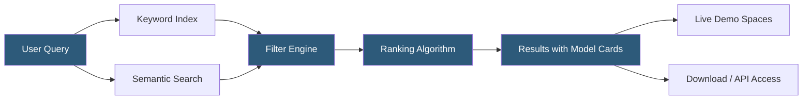

**Category:** AI Model Marketplaces
**Difficulty:** Beginner
**Reading time:** 5 min read

---

Model search and discovery systems help practitioners locate the most relevant AI models within large repositories containing hundreds of thousands of options. Effective discovery combines semantic search, structured filtering, and community signals to surface models that match specific task, modality, license, and performance requirements.

- **Task tag** — categorical label (text-classification, text-generation, image-segmentation, etc.) used to filter models by their primary capability
- **Model card embedding** — vector representation of a model card's content enabling semantic similarity search across descriptions and use cases
- **Trending filter** — discovery surface prioritizing models gaining rapid download or community engagement momentum
- **License filter** — search constraint restricting results to models with compatible usage terms
- **Framework filter** — restriction by training or inference framework (PyTorch, TensorFlow, JAX, ONNX)
- **Dataset lineage** — metadata linking a model to its training datasets, enabling discovery by data source
- **Spaces integration** — live demo environments linked directly to model listings, enabling try-before-you-download evaluation

Hugging Face, the largest public model hub, indexes over 900,000 models with a search architecture combining BM25 keyword retrieval with dense vector retrieval over model card embeddings. Users can filter simultaneously by task, language, license, dataset, model size, and framework. A relevance ranking model combines text match scores with popularity signals (download counts, likes, recent activity).

Specialized marketplace platforms use different discovery strategies. Replicate surfaces models through curated collections and a feed of recently published models with live demo videos. NVIDIA NGC organizes models into a product catalog aligned with specific hardware and use case categories (computer vision, NLP, speech, healthcare). AWS SageMaker JumpStart uses structured taxonomy browsing reinforced by recommendation algorithms based on user browsing history.

Model card quality directly impacts discoverability: well-documented models with detailed use case descriptions, evaluation results, and usage examples rank higher because their card text provides richer signal for both keyword and semantic retrieval systems. Community engagement (GitHub stars for associated repos, Hugging Face likes, discussion activity) serves as an additional ranking factor.

Enterprise catalog tools (Azure AI Model Catalog, Google Model Garden) layer internal procurement controls atop discovery—only models approved by the organization's AI governance team appear in search results for business users. This curated discovery pattern reduces accidental deployment of unapproved models.

- Finding all Apache 2.0 licensed text embedding models with at least 10,000 monthly downloads
- Discovering recently published instruction-tuned Mistral variants for evaluation
- Locating domain-specific models trained on medical literature for a clinical NLP project
- Browsing model families from a specific organization to find the appropriate size tier
- Finding models with associated live demos to test before downloading weights

| Advantage | Disadvantage |
|-----------|--------------|
| Faceted filtering dramatically narrows large model repositories | Popular but outdated models can dominate results over newer alternatives |
| Semantic search finds conceptually related models beyond keyword matches | Model card quality varies widely, degrading search recall for underdocumented models |
| Trending discovery surfaces new models gaining community validation | Popularity signals can create self-reinforcing cycles disadvantaging niche models |
| Linked demo environments enable evaluation without infrastructure setup | Discovery is siloed per marketplace; no cross-platform unified search exists |

- [Model Comparison Tools](model-comparison-tools.md)
- [Model Versioning in Marketplaces](model-versioning-in-marketplaces.md)
- [Model Download Statistics](model-download-statistics.md)

---
*Part of the [AI Model Marketplaces](index.md) category · [Back to Master Index](../../index.md)*
