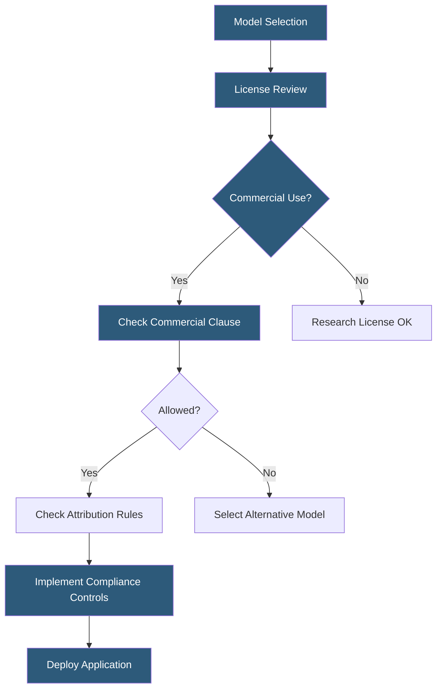

**Category:** AI Model Marketplaces
**Difficulty:** Intermediate
**Reading time:** 6 min read

---

Model usage terms define the legal and operational boundaries under which AI models may be accessed, fine-tuned, distributed, and commercialized. Understanding these terms is critical for organizations building products on top of pre-trained models, as violations can trigger service termination, legal liability, or reputational damage.

- **End User License Agreement (EULA)** — contractual terms governing how a model can be used, often prohibiting certain industries or use cases
- **Acceptable Use Policy (AUP)** — platform-level rules covering prohibited content generation, harmful output, and misuse scenarios
- **Attribution requirement** — obligation to credit the model creator or include specific notices in downstream products
- **Commercial use clause** — explicit permission or restriction on monetizing applications built with the model
- **Derivative works** — models produced by fine-tuning or distilling a base model; licensing may require the derivative to carry the same terms
- **API terms vs weight terms** — hosting a model via API versus downloading weights may carry different obligations
- **Data residency constraints** — requirements that inference requests or outputs stay within specified geographic regions

Model usage terms operate at multiple layers simultaneously. At the weight level, licenses such as Apache 2.0, MIT, CC-BY, and custom frameworks like Meta's Llama Community License each establish distinct rights. Apache 2.0 and MIT are permissive, allowing commercial deployment without revenue sharing obligations. CC-BY requires attribution but allows derivatives. Proprietary licenses from vendors like OpenAI or Anthropic attach to API access rather than distributed weights, making terms contingent on API service agreements that can change with notice.

Fine-tuning introduces complexity: if a base model is released under CC-BY-SA (ShareAlike), any fine-tuned derivative must also be released under the same terms, precluding proprietary commercialization. Model distillation—training a smaller model to mimic a larger one—falls into a legal gray area under many licenses; some explicitly prohibit using model outputs to train competing models (OpenAI's terms, for example, historically contained such clauses).

Enforcement mechanisms include API key revocation, automated output scanning for policy violations, and legal action for egregious misuse. Organizations should maintain a model license inventory, review terms upon each model version update, and implement internal AUP controls that mirror or exceed the upstream model's restrictions. Contract management platforms can track expiry of enterprise agreements with model providers.

- Legal review before launching an AI-powered SaaS product built on a third-party model
- Procurement decisions choosing between equivalent open-source and proprietary models based on license flexibility
- Enterprise compliance audits ensuring all internal AI tools respect upstream model terms
- Publishing a fine-tuned model derivative on Hugging Face without violating the base model's license
- Negotiating custom enterprise licenses with model providers for higher-volume or restricted-use deployments

| Advantage | Disadvantage |
|-----------|--------------|
| Clear permissive licenses reduce legal risk for commercial products | Proprietary terms can restrict competitive analysis or benchmarking |
| Open licenses enable community improvement and ecosystem growth | Share-alike requirements may force open-sourcing of proprietary fine-tunes |
| API-based access simplifies compliance vs managing downloaded weights | API terms can change unilaterally, disrupting production systems |
| Attribution requirements provide credit to researchers and institutions | Attribution obligations can complicate product branding |

- [Pre-trained Model Licensing](pre-trained-model-licensing.md)
- [Model Safety Ratings](model-safety-ratings.md)
- [Commercial vs Open-Source Models](commercial-vs-open-source-models.md)

---
*Part of the [AI Model Marketplaces](index.md) category · [Back to Master Index](../../index.md)*
