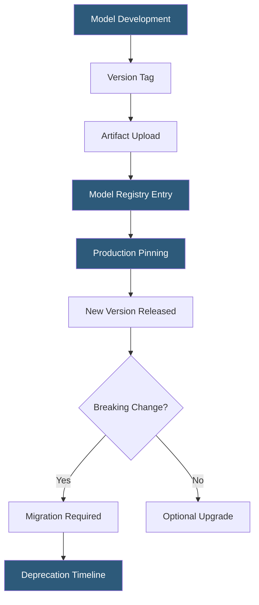

**Category:** AI Model Marketplaces
**Difficulty:** Intermediate
**Reading time:** 6 min read

---

Model versioning in marketplaces tracks changes to AI model weights, configurations, and associated artifacts over time, enabling reproducibility, rollback, and systematic capability comparison across model generations. Robust versioning is essential for production deployments where silent model updates can cause unexpected behavior changes.

- **Git LFS (Large File Storage)** — Git extension used by Hugging Face to store multi-gigabyte model weights with full version history
- **Commit hash pinning** — referencing a specific model revision by its immutable SHA hash to prevent unintended updates
- **Semantic versioning for models** — applying major.minor.patch versioning conventions to model releases, where major bumps indicate capability changes and patches fix bugs
- **Model registry** — centralized catalog tracking model versions, their metadata, and deployment status
- **Immutable artifacts** — versioned model weights stored such that existing references always resolve to the same bytes
- **Deprecation policy** — vendor schedule for retiring older model versions with migration guidance
- **Snapshot vs delta storage** — strategies for storing versioned model weights, either as full snapshots or incremental differences

Hugging Face implements model versioning through Git repositories with LFS for large binary files. Every model upload creates a commit with a unique SHA hash. Users can pin to a specific commit (e.g., `revision="abc123"`) in API calls or download commands, ensuring their application always uses the same weights regardless of subsequent uploads to the repository. This immutability by reference is critical for reproducible research and stable production deployments.

API-based model providers handle versioning differently: OpenAI uses date-stamped model names (gpt-4-0613) alongside alias names (gpt-4) that route to the "current" recommended version. Anthropic uses claude-3-5-sonnet-20241022 style naming. Callers who use alias names get automatic updates when the provider rotates to a newer model version, while those pinning to dated identifiers get stability at the cost of not receiving improvements.

Replicate versions models by machine learning framework container images. Each model version receives a unique hash and its own Docker container, making each version independently deployable and rollback-safe.

Enterprise MLOps platforms (MLflow, SageMaker Model Registry, Azure ML Model Registry) add governance layers: model versions must pass quality gates before transitioning from Staging to Production status, and rollback operations restore a previous production-registered version atomically.

Storage efficiency is managed through deduplication at the weight level—model families sharing base weights (e.g., fine-tuned variants of Llama) store the base weights once and only persist the LoRA adapter deltas or full fine-tune deltas per variant.

- Pinning a production LLM API call to a specific dated model to prevent unexpected behavior from vendor updates
- Rolling back to a previous model version after a new release degrades task-specific performance
- Maintaining regulatory audit trails showing which exact model version produced historical outputs
- A/B testing two consecutive model versions in production to measure real-world impact
- Academic reproducibility—publishing a model commit hash alongside research results

| Advantage | Disadvantage |
|-----------|--------------|
| Pinned versions prevent silent regressions from vendor model swaps | Pinning to old versions misses security patches and capability improvements |
| Full version history enables root cause analysis of behavioral changes | Storing complete weight snapshots per version consumes significant storage |
| Immutable artifacts ensure bitwise reproducibility across environments | Vendor deprecation schedules force migration work even for stable systems |
| Semantic version conventions communicate change severity to consumers | Alias-based routing (gpt-4) provides convenience at the cost of stability |

- [Model Download Statistics](model-download-statistics.md)
- [Model Search and Discovery](model-search-and-discovery.md)
- [Model Community Ratings](model-community-ratings.md)

---
*Part of the [AI Model Marketplaces](index.md) category · [Back to Master Index](../../index.md)*
