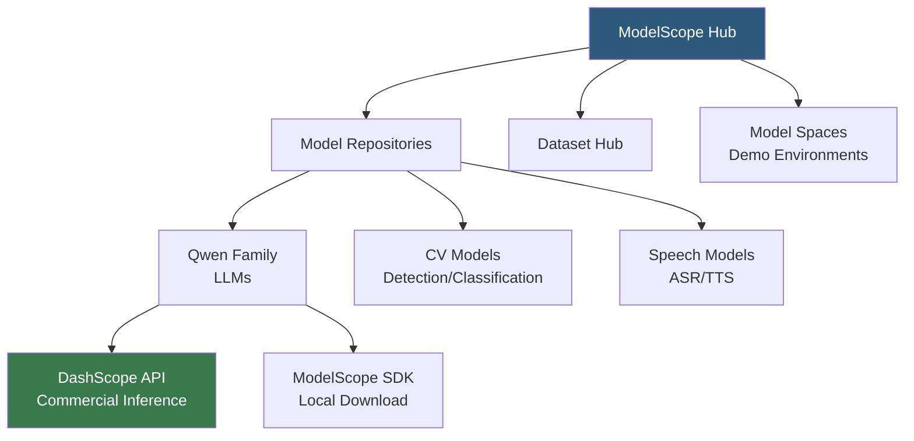

**Category:** AI Model Marketplaces
**Difficulty:** Intermediate
**Reading time:** 5 min read

---

ModelScope is Alibaba Cloud's open-source model hub and community platform, hosting thousands of AI models from Chinese research institutes, universities, and industry labs alongside international contributions. It provides a Hugging Face-like experience optimized for the Chinese AI ecosystem, with deep integration into Alibaba's Tongyi Qwen model family and cloud infrastructure.

- **ModelScope SDK** — the Python library for downloading models, running pipelines, and interacting with the hub API
- **Pipeline abstraction** — ModelScope's high-level inference interface analogous to Hugging Face's `pipeline()` function
- **Tongyi Qwen** — Alibaba's flagship open-weight LLM family (Qwen2, Qwen2.5) distributed through ModelScope
- **DashScope** — Alibaba Cloud's commercial AI API service offering Qwen and other models as API endpoints
- **Model space** — interactive demo environments hosted on ModelScope for testing models in the browser
- **Dataset hub** — ModelScope's companion dataset repository for ML training data, analogous to Hugging Face Datasets

ModelScope follows a similar architecture to Hugging Face Hub: model repositories are Git-LFS-backed stores containing weights, configuration files, and tokenizer assets. The `modelscope` Python library provides `snapshot_download()` for bulk model downloads and `pipeline()` for task-based inference with automatic model selection.

The hub hosts models primarily from Alibaba DAMO Academy, Fudan University, and other Chinese AI organizations. Qwen models — including Qwen2.5 in 0.5B to 72B parameter sizes — are among the most downloaded, offering strong multilingual performance with particular strength in Chinese and code tasks.

ModelScope supports the same `from_pretrained()` loading pattern as Hugging Face Transformers for Qwen and other compatible models, since many ModelScope models also publish on Hugging Face Hub simultaneously. The `modelscope` SDK resolves model IDs from the ModelScope registry first, falling back to Hugging Face if not found locally.

DashScope provides the commercial API layer, offering Qwen models as REST endpoints with per-token pricing comparable to GPT-4o-mini. DashScope also integrates with Alibaba Cloud's ARMS monitoring and RAM (Resource Access Management) for enterprise deployments.

- Downloading Qwen2.5 72B for fine-tuning on Chinese-language enterprise documents
- Using ModelScope's speech recognition models for Mandarin transcription applications
- Accessing cutting-edge Chinese NLP research models before they are published on international platforms
- Building multilingual applications leveraging Qwen's strong Chinese-English code-switching capability

| Advantage | Disadvantage |
|-----------|--------------|
| Largest collection of Chinese-language and Chinese-research models | Documentation and community support primarily in Chinese; English resources lag |
| Qwen models offer competitive performance at open-weight accessibility | Model provenance and safety evaluation less standardized than Hugging Face norms |
| Deep Alibaba Cloud integration for DashScope commercial API | Slower adoption of international open-source models compared to Hugging Face Hub |

- [Hugging Face Model Hub](hugging-face-model-hub.md)
- [Commercial vs Open-Source Models](commercial-vs-open-source-models.md)
- [Pre-trained Model Licensing](pre-trained-model-licensing.md)

---
*Part of the [AI Model Marketplaces](index.md) category · [Back to Master Index](../../index.md)*
