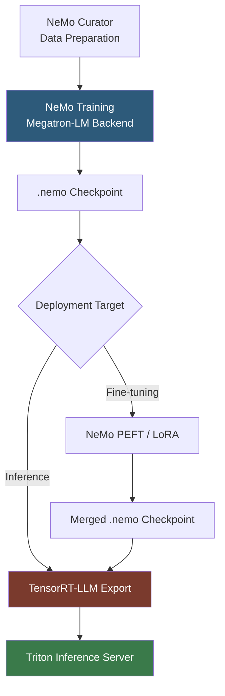

**Category:** AI Model Marketplaces
**Difficulty:** Intermediate
**Reading time:** 6 min read

---

NVIDIA NeMo is an open-source framework and model collection for building, fine-tuning, and deploying large language models and speech AI systems. NeMo models distributed through NGC provide production-ready checkpoints for LLM training and conversational AI, optimized for multi-GPU and multi-node NVIDIA hardware.

- **NeMo checkpoint** — a `.nemo` file containing model weights, configuration, and tokenizer in a single archive for easy portability
- **Megatron-LM** — the distributed training backend within NeMo that implements tensor and pipeline parallelism for training models with billions of parameters
- **PEFT (Parameter-Efficient Fine-Tuning)** — NeMo's support for LoRA, P-tuning, and adapter methods that fine-tune a fraction of model weights
- **NeMo Guardrails** — a library for enforcing topical, safety, and factual constraints on LLM outputs in production
- **NeMo Curator** — a data pipeline for large-scale dataset preparation including deduplication, quality filtering, and domain classification
- **Riva** — NVIDIA's conversational AI SDK built on NeMo models, providing ASR, TTS, and NLP for real-time speech applications

NeMo uses PyTorch Lightning as its training loop backbone and Megatron-LM for the distributed training strategy. When training multi-billion-parameter models, Megatron implements tensor parallelism (splitting individual weight matrices across GPUs) and pipeline parallelism (assigning model layers to different GPU stages) to fit models that exceed single-GPU VRAM.

NeMo model checkpoints use the `.nemo` format — a renamed ZIP archive containing `model_config.yaml`, tokenizer files, and sharded weights. This self-contained format ensures the model can be restored without external configuration lookup.

For inference, NeMo checkpoints are exported to TensorRT-LLM, NVIDIA's inference library that compiles transformer blocks into optimized CUDA graphs, applies INT8 or FP8 quantization, and implements paged KV-caching. The resulting TensorRT-LLM engine is then served via Triton Inference Server, which handles batching, concurrency, and gRPC/HTTP request routing.

NeMo Guardrails adds a programmable conversation flow layer using Colang, a domain-specific language for specifying allowed topics, bot personas, and fallback behaviors. This layer intercepts LLM calls and enforces policy constraints at the application level without modifying model weights.

- Training a 13B-parameter domain-specific LLM on a 16-GPU cluster using Megatron-LM's tensor parallelism
- Fine-tuning a NeMo Llama checkpoint with LoRA adapters for customer support use cases
- Deploying a real-time ASR service using NeMo speech models via the Riva SDK
- Enforcing topical safety policies on a deployed chatbot using NeMo Guardrails

| Advantage | Disadvantage |
|-----------|--------------|
| Deep NVIDIA hardware integration enables near-linear multi-GPU scaling | Strong NVIDIA dependency; non-trivial to run on AMD or CPU environments |
| Self-contained .nemo format simplifies checkpoint portability | Learning curve is steep; NeMo, Megatron, and TensorRT-LLM are separate systems |
| TensorRT-LLM inference can be 3–5x faster than naive PyTorch inference | TensorRT-LLM compilation takes significant time (minutes to hours for large models) |

- [NVIDIA NGC Catalog](nvidia-ngc-catalog.md)
- [Model Performance Benchmarks](model-performance-benchmarks.md)
- [Pre-trained Model Licensing](pre-trained-model-licensing.md)

---
*Part of the [AI Model Marketplaces](index.md) category · [Back to Master Index](../../index.md)*
