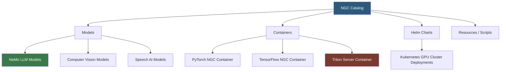

**Category:** AI Model Marketplaces
**Difficulty:** Intermediate
**Reading time:** 6 min read

---

NVIDIA GPU Cloud (NGC) is an enterprise-grade catalog of GPU-optimized AI software including pretrained models, Helm charts, container images, and SDKs. It serves as NVIDIA's official distribution channel for AI assets tuned specifically for NVIDIA hardware, providing performance-validated containers that deploy identically across cloud, on-premise, and edge environments.

- **NGC container** — a Docker image pre-configured with CUDA, cuDNN, TensorRT, and framework libraries, tested on NVIDIA hardware for optimal performance
- **TensorRT model** — a model optimized by NVIDIA's inference compiler that fuses layers and reduces precision to maximize throughput on NVIDIA GPUs
- **NeMo** — NVIDIA's framework for training and fine-tuning large language and speech models, distributed through NGC
- **Triton Inference Server** — NVIDIA's open-source, multi-framework model serving platform available as an NGC container
- **NGC Private Registry** — an enterprise feature allowing organizations to store proprietary models and containers in a secure NGC tenant
- **Helm chart** — Kubernetes deployment manifests in NGC for deploying AI workloads on GPU-enabled clusters

NGC containers are built on top of base Ubuntu images with specific CUDA toolkit versions and are tested monthly against the latest NVIDIA driver releases. Each container is tagged with a version string encoding the year, month, and patch (e.g., `24.01`). NVIDIA's validation matrix ensures that a specific NGC container version works correctly with specific driver versions, eliminating compatibility guesswork.

Models in the catalog are typically distributed as TensorRT engine files (for inference) or NeMo checkpoint files (for fine-tuning). TensorRT engines are hardware-specific — an engine built for A100 will not run on T4 — so NGC provides either source checkpoints or build scripts that compile engines for the target GPU during deployment.

The `ngc` CLI tool authenticates with an API key and supports `ngc registry model download-version` for fetching large model assets with resumable downloads. Enterprise customers accessing the NGC Private Registry store custom models alongside curated NGC content under the same authentication flow.

For Kubernetes deployments, NGC Helm charts include GPU resource requests, affinity rules for GPU node pools, and pre-configured Triton Server instances with model repository mounts, enabling one-command deployment of production inference services.

- Deploying a speech recognition service using NGC's Riva container on on-premise NVIDIA GPUs
- Pulling an NGC PyTorch container to ensure reproducible training results across team members' workstations
- Downloading a NeMo checkpoint to fine-tune an LLM on company-specific terminology
- Using NGC Helm charts to deploy a Triton Inference Server cluster on a Kubernetes GPU node pool

| Advantage | Disadvantage |
|-----------|--------------|
| Containers are tested monthly on real NVIDIA hardware, reducing compatibility issues | Assets are NVIDIA-specific; TensorRT engines do not run on AMD or Intel GPUs |
| Enterprise NGC Private Registry enables secure proprietary model distribution | Free tier limits download bandwidth; enterprise features require subscription |
| TensorRT optimization can yield 2–4x inference speedup over PyTorch | TensorRT compilation adds deployment complexity and build time |

- [NVIDIA NeMo Models](nvidia-nemo-models.md)
- [Model Performance Benchmarks](model-performance-benchmarks.md)
- [Domain-specific Model Collections](domain-specific-model-collections.md)

---
*Part of the [AI Model Marketplaces](index.md) category · [Back to Master Index](../../index.md)*
