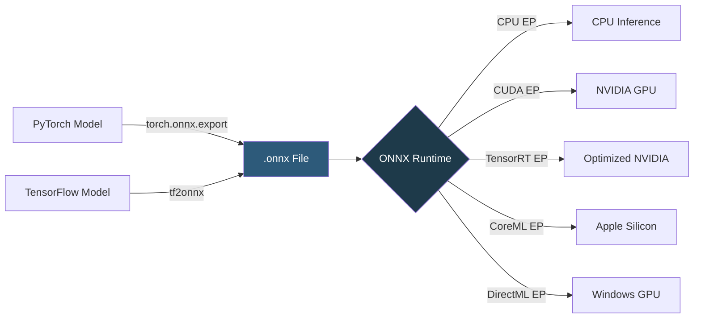

**Category:** AI Model Marketplaces
**Difficulty:** Intermediate
**Reading time:** 5 min read

---

The ONNX Model Zoo is a collection of pretrained machine learning models in the Open Neural Network Exchange (ONNX) format, maintained by the ONNX community on GitHub. ONNX's framework-agnostic representation allows models trained in PyTorch or TensorFlow to run on any ONNX Runtime-compatible environment, enabling cross-framework portability.

- **ONNX format** — an open graph-based model serialization format that represents neural networks as a DAG of standardized operators with typed tensors
- **ONNX Runtime (ORT)** — Microsoft's cross-platform inference engine for ONNX models, optimized for CPUs, GPUs, and specialized accelerators
- **Opset version** — a versioned set of ONNX operators; models declare their opset, and runtimes must support it to execute the model
- **Execution provider** — an ORT plugin that routes graph subsets to specific hardware (CUDA, TensorRT, DirectML, CoreML)
- **Dynamic axes** — ONNX export setting allowing variable batch sizes and sequence lengths without recompiling the model
- **Model validation** — checking that an exported ONNX graph produces numerically equivalent outputs to the original framework model

ONNX represents a model as a protobuf-serialized computation graph where each node corresponds to an operator from the ONNX operator set (e.g., `Conv`, `MatMul`, `LayerNormalization`). Nodes have named inputs and outputs that connect through the graph. Weights are embedded as `Initializer` tensors within the protobuf.

Models are exported to ONNX from PyTorch using `torch.onnx.export()`, which traces through the model's forward pass with example inputs and records the operations. TensorFlow models use the `tf2onnx` converter. The resulting `.onnx` file can be loaded by ONNX Runtime (`ort.InferenceSession`) on any supported platform.

ONNX Runtime applies graph optimizations at load time: constant folding, redundant node elimination, and operator fusion (e.g., fusing BatchNorm into Conv). When a CUDA Execution Provider is used, ORT further applies cuDNN and CUBLAS kernel selection. The TensorRT Execution Provider compiles graph subsets into TensorRT engines for maximum NVIDIA throughput.

The Model Zoo hosts canonical ONNX exports of common architectures (ResNet, BERT, GPT-2, EfficientNet) with standardized input/output tensor names, making them drop-in compatible with applications expecting those schemas.

- Deploying a PyTorch-trained NLP model on a Windows machine using DirectML acceleration
- Running a BERT model on an iPhone using the CoreML Execution Provider via ONNX Runtime
- Reducing BERT inference latency 4x by using the TensorRT Execution Provider on NVIDIA hardware
- Sharing a trained model with a team member using a different ML framework

| Advantage | Disadvantage |
|-----------|--------------|
| Framework-agnostic format enables cross-platform deployment without code changes | Dynamic Python control flow (Python if/for) cannot be represented and requires tracing workarounds |
| ONNX Runtime's graph optimizations often outperform naive framework inference | ONNX opset upgrades break older models; runtime compatibility matrix is complex |
| Single binary deployment; no ML framework dependency at inference time | Not all operators are supported across all execution providers; fallback to CPU can silently degrade performance |

- [PyTorch Hub](pytorch-hub.md)
- [TensorFlow Hub](tensorflow-hub.md)
- [Model Performance Benchmarks](model-performance-benchmarks.md)

---
*Part of the [AI Model Marketplaces](index.md) category · [Back to Master Index](../../index.md)*
