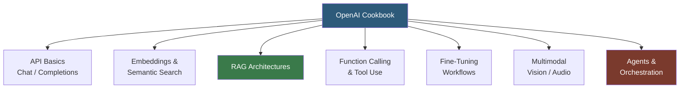

**Category:** AI Model Marketplaces
**Difficulty:** Beginner
**Reading time:** 5 min read

---

The OpenAI Cookbook is a public GitHub repository of Jupyter notebooks demonstrating best practices, patterns, and techniques for using OpenAI's API. It serves as the authoritative reference for applied AI engineering with OpenAI models, covering topics from basic API usage to advanced RAG architectures, fine-tuning, and multi-modal applications.

- **Notebook recipe** — a Jupyter notebook in the Cookbook that demonstrates a specific technique with runnable code and explanatory prose
- **Embeddings** — numerical vector representations of text produced by OpenAI's `text-embedding-3-small/large` models, used for semantic search and similarity
- **RAG (Retrieval Augmented Generation)** — a pattern where relevant documents are retrieved from a vector store and included in the model's context before generation
- **Function calling** — OpenAI's API feature for reliably extracting structured JSON from model responses or enabling tool use
- **Tiktoken** — OpenAI's open-source tokenizer library, used in Cookbook examples for counting tokens and managing context windows
- **Streaming** — the API pattern of receiving tokens as they are generated using SSE, demonstrated in Cookbook examples for responsive UIs

The Cookbook at github.com/openai/openai-cookbook is structured as a collection of Jupyter notebooks organized by topic. Each notebook is self-contained with pip install cells, API key setup via environment variables, and step-by-step code cells with markdown explanations. Notebooks are executable in Google Colab, GitHub Codespaces, or locally.

Key recipe categories include: chat completion patterns (streaming, function calling, JSON mode), embeddings workflows (nearest neighbor search, clustering, classification), RAG pipelines (chunking strategies, vector store integration with Pinecone/Weaviate/pgvector), and fine-tuning walkthroughs (data preparation, training, evaluation).

The Cookbook is community-contributed with OpenAI editorial review. Accepted contributions demonstrate real engineering patterns at production quality. The most-referenced notebooks (like "Question Answering using Embeddings") accumulate thousands of GitHub stars and serve as the starting implementation for countless RAG applications.

Companion utilities like the tokenizer cookbook demonstrate efficient context window management, crucial for controlling API costs when building applications that process large documents.

- Implementing a document Q&A system using the embeddings + RAG notebook as a blueprint
- Learning how to use function calling to extract structured data from unstructured text
- Setting up a fine-tuning pipeline for a classification task using the fine-tuning guide notebook
- Building a streaming chat UI by studying the streaming response example notebook

| Advantage | Disadvantage |
|-----------|--------------|
| Authoritative, production-tested patterns from the model creators | Examples are OpenAI-specific; patterns require adaptation for other providers |
| Community contributions add breadth beyond official examples | Notebooks can become outdated as API versions and best practices evolve |
| Runnable notebooks reduce time from reading to working code | Some advanced patterns assume significant ML background; not beginner-friendly |

- [Anthropic Prompt Library](anthropic-prompt-library.md)
- [LangChain Hub](langchain-hub.md)
- [LlamaIndex Data Connectors](llamaindex-data-connectors.md)

---
*Part of the [AI Model Marketplaces](index.md) category · [Back to Master Index](../../index.md)*
