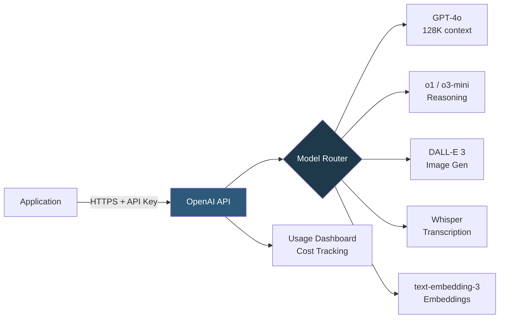

**Category:** AI Model Marketplaces
**Difficulty:** Beginner
**Reading time:** 5 min read

---

OpenAI's model marketplace encompasses the GPT-4, o-series, DALL-E, Whisper, and embedding model families available through its API platform. It represents the dominant commercial AI model distribution channel, where developers access state-of-the-art proprietary models on a pay-per-token basis without managing any infrastructure.

- **Model snapshot** — a versioned, static model identifier (e.g., `gpt-4o-2024-08-06`) that guarantees frozen behavior for reproducible production systems
- **Auto-updating alias** — a model identifier without a date suffix (e.g., `gpt-4o`) that OpenAI updates to the latest stable snapshot
- **Context window** — the maximum number of tokens a model can process in a single request; GPT-4o supports 128K tokens
- **Function calling** — a structured API feature that constrains model output to JSON matching a developer-defined schema, enabling tool use
- **Fine-tuning** — OpenAI's API for training on custom JSONL datasets to adapt model behavior, available for GPT-4o-mini and GPT-3.5-turbo
- **Batch API** — an asynchronous endpoint that processes large workloads at 50% cost reduction with 24-hour turnaround

OpenAI's platform routes API requests authenticated with bearer tokens to model-specific inference clusters. Pricing is metered per million input tokens and per million output tokens (output costs roughly 3–5x input because autoregressive generation requires sequential GPU passes). Rate limits are enforced per organization at tokens-per-minute and requests-per-minute tiers, which increase with spending history.

Streaming responses use server-sent events (SSE), delivering tokens as they are generated with ~50–200ms time-to-first-token. Non-streaming requests buffer the full response before returning, adding latency equal to full generation time.

Model versioning follows a two-track system: date-pinned snapshots for reproducibility and auto-updating aliases for applications that want the latest improvements automatically. OpenAI maintains at least 3 months' notice before deprecating a snapshot, migrating it to a successor.

The fine-tuning API accepts JSONL files with `messages` arrays matching the chat completion format. Training runs asynchronously on OpenAI's infrastructure; completion triggers a webhook. Fine-tuned model IDs follow the pattern `ft:gpt-4o-mini:org-id:custom-name:suffix`.

- Building a customer-facing chatbot using GPT-4o with function calling to query a product database
- Batch-processing 100,000 documents for summarization overnight using the Batch API at half-price
- Fine-tuning GPT-4o-mini on company-specific tone and terminology for support automation
- Transcribing customer call recordings at scale using Whisper through the audio API

| Advantage | Disadvantage |
|-----------|--------------|
| No infrastructure management; scales instantly to millions of requests | Data is sent to OpenAI servers, raising confidentiality concerns |
| Consistent, well-documented API with broad ecosystem tooling | Proprietary models; no access to weights for self-hosting or inspection |
| Model updates improve capability automatically via auto-updating aliases | Auto-updating aliases can break behavior; pinned snapshots eventually deprecated |

- [Anthropic Model Catalog](anthropic-model-catalog.md)
- [Model Usage Terms](model-usage-terms.md)
- [Model Performance Benchmarks](model-performance-benchmarks.md)

---
*Part of the [AI Model Marketplaces](index.md) category · [Back to Master Index](../../index.md)*
