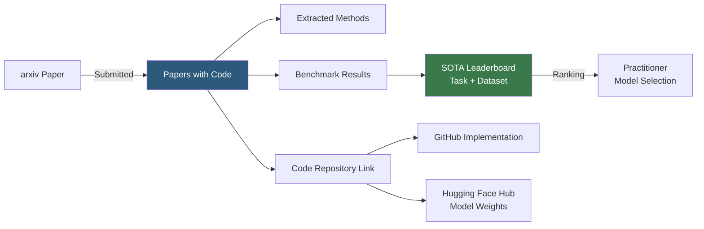

**Category:** AI Model Marketplaces
**Difficulty:** Beginner
**Reading time:** 5 min read

---

Papers with Code is a free resource that links academic ML research papers to their official and community code implementations, datasets, and model checkpoints. It serves as a curated leaderboard and discovery platform where practitioners can find state-of-the-art models for specific tasks, compare benchmark performance, and jump directly to working implementations.

- **State-of-the-art (SOTA) table** — a leaderboard showing ranked model performance on a specific task/dataset combination, automatically updated from paper submissions
- **Methods** — reusable architectural components (attention mechanisms, normalization layers) extracted from papers and linked to their originating publications
- **Benchmark** — a standardized evaluation dataset and metric combination (e.g., ImageNet Top-1 accuracy) used to compare model performance
- **Code link** — a GitHub repository reference attached to a paper, verified by the community to contain the described implementation
- **Trends page** — an aggregated view showing which tasks and methods are receiving the most research attention recently
- **Hugging Face integration** — SOTA models on Papers with Code often link directly to their Hugging Face Hub repository for instant download

Papers with Code aggregates papers from arXiv, tracks code links submitted by paper authors or community members, and extracts benchmark results from paper tables. The extraction combines automated parsing of result tables with community corrections. When a paper claims a SOTA result on ImageNet or SQuAD, that result is added to the corresponding leaderboard with a link to the paper.

The leaderboard system allows practitioners to filter by metric, dataset split, hardware constraint, and model size. This is particularly valuable for selecting models under production constraints — for example, finding the most accurate image classifier that runs in under 10ms on a single V100.

The Methods taxonomy links architectural innovations (Transformer, LSTM, Batch Normalization) to every paper that uses them, enabling research tracking across years. The Trends feature shows which methods are appearing in the most recent papers, helping practitioners identify emerging techniques before they become mainstream.

Integration with Hugging Face Hub is deep: model pages on Papers with Code often embed the Hub's `from_pretrained()` snippet, enabling one-click access to weights for papers whose authors published on both platforms.

- Finding the current best-performing model on COCO object detection before starting a computer vision project
- Identifying all papers that use a specific architectural component to understand its evolution
- Checking whether a newly published paper's claimed SOTA results hold up against comparable baselines
- Discovering official code implementations for papers to avoid re-implementing from scratch

| Advantage | Disadvantage |
|-----------|--------------|
| Free, comprehensive resource covering thousands of tasks and benchmarks | Leaderboard results are self-reported; occasional errors or cherry-picked configurations |
| Direct links to code reduce time from paper to working implementation | Not all papers have linked code; implementation quality varies widely |
| SOTA tables enable rapid model selection based on quantitative performance | Benchmark results may not transfer to production distribution; always validate on own data |

- [Kaggle Models](kaggle-models.md)
- [Model Performance Benchmarks](model-performance-benchmarks.md)
- [Model Comparison Tools](model-comparison-tools.md)

---
*Part of the [AI Model Marketplaces](index.md) category · [Back to Master Index](../../index.md)*
