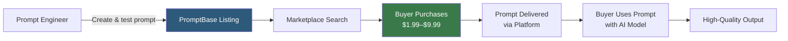

**Category:** AI Model Marketplaces
**Difficulty:** Beginner
**Reading time:** 5 min read

---

PromptBase is a marketplace for buying and selling AI prompts for models like GPT-4, DALL-E, Midjourney, Stable Diffusion, and Claude. Rather than trading model weights, PromptBase commercializes prompt engineering expertise — buyers purchase structured prompts that reliably produce high-quality outputs for specific tasks.

- **Prompt listing** — a product on PromptBase consisting of a prompt text, example outputs, and a description of its intended use case
- **Prompt engineering** — the craft of designing input text that reliably elicits high-quality, consistent outputs from a language or image model
- **DALL-E prompt** — a natural language description optimized for DALL-E's image generation model, often including style keywords and composition directives
- **Midjourney prompt** — an image generation prompt with Midjourney-specific parameter flags (`--ar`, `--v`, `--stylize`) tuned for that platform
- **Prompt template** — a prompt with placeholders (e.g., `[PRODUCT NAME]`, `[AUDIENCE]`) that buyers customize for their specific use case
- **Seller commission** — PromptBase takes approximately 20% of each prompt sale; sellers retain 80%

Sellers create listings by writing and testing their prompt against the target model, capturing example outputs as screenshots, setting a price (typically $1.99–$9.99), and categorizing the listing by model type and use case. PromptBase reviews listings for quality and policy compliance before publishing.

Buyers browse by category (copywriting, image generation, code, data analysis) and preview example outputs before purchasing. After payment, the full prompt text is delivered through the platform. Some prompts include usage instructions for customizing placeholders or combining with model-specific features like function calling.

The platform addresses a real value proposition: effective prompts for complex tasks (e.g., generating consistent brand-voice marketing copy, or creating specific artistic styles in Midjourney) require iterative testing and domain expertise. Buying a proven prompt saves time and model API costs spent on experimentation.

PromptBase also offers a prompt generation feature where users describe their desired output and the platform suggests a structured prompt, lowering the barrier for buyers who lack prompt engineering knowledge.

- Purchasing a Midjourney prompt that consistently generates product photography with transparent backgrounds
- Buying a GPT-4 prompt for transforming raw meeting notes into structured action item summaries
- Selling a collection of tested DALL-E prompts for generating UI mockup illustrations
- Using a prompt template for generating consistent social media posts across different topics

| Advantage | Disadvantage |
|-----------|--------------|
| Access to expertly tested prompts without time-consuming prompt engineering trial and error | Prompt effectiveness degrades as models are updated; purchased prompts may become less reliable |
| Low price point ($1.99–$9.99) makes prompt acquisition accessible | Buyers cannot verify prompt quality without testing; refund policies vary |
| Sellers can monetize prompt engineering expertise without model training infrastructure | Market is easily undercut; similar prompts are often freely shared in communities |

- [Anthropic Prompt Library](anthropic-prompt-library.md)
- [OpenAI Cookbook Recipes](openai-cookbook-recipes.md)
- [LangChain Hub](langchain-hub.md)

---
*Part of the [AI Model Marketplaces](index.md) category · [Back to Master Index](../../index.md)*
