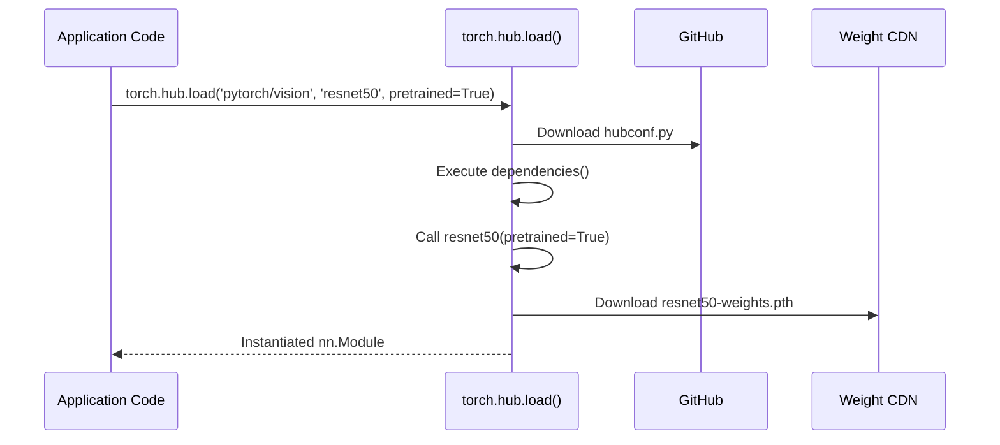

**Category:** AI Model Marketplaces
**Difficulty:** Intermediate
**Reading time:** 5 min read

---

PyTorch Hub is a pre-trained model repository that allows researchers and developers to discover and load curated PyTorch models with a single function call. It emphasizes reproducibility by linking models directly to their GitHub source code, enabling one-line model instantiation with automatically downloaded weights.

- **hubconf.py** — a Python file in a GitHub repository that defines entry point functions returning instantiated PyTorch models; required for Hub registration
- **torch.hub.load()** — the primary API for loading a Hub model, taking a `repo_owner/repo_name` GitHub path and an entry point function name
- **Dependency resolution** — Hub executes `dependencies()` in `hubconf.py` to install required packages before instantiating the model
- **Local cache** — downloaded model weights are stored in `~/.cache/torch/hub/` to avoid re-downloading on subsequent calls
- **Trusted repos** — users must explicitly pass `trust_repo=True` since hub code executes arbitrary Python from GitHub
- **Entry point** — a function in `hubconf.py` decorated with `@torch.hub.export` that returns a model instance, optionally accepting pretrained flag

`torch.hub.load()` first downloads the `hubconf.py` from the specified GitHub repo (resolving the branch/tag/commit if specified). It then imports the module in an isolated context, calls any declared `dependencies()` to install pip packages, and invokes the specified entry point function.

If `pretrained=True` is passed, the entry point typically calls `torch.hub.load_state_dict_from_url()` to download the weight file from a URL specified in the `hubconf.py`. The downloaded `.pth` or `.pt` file is cached locally. On subsequent calls, the local cache is used, making loading fast.

Trust is a critical security consideration: since `hubconf.py` is arbitrary Python code executed on the caller's machine, `trust_repo=True` must be set explicitly for non-official repos. Official PyTorch organization repos (`pytorch/vision`, `pytorch/text`, `pytorch/audio`) are considered trusted by convention.

The Hub model catalog is not a centralized registry — it is distributed across GitHub repositories. The `torch.hub.list()` function queries a repo's `hubconf.py` to enumerate available models. This decentralized design means model availability and quality vary widely, and model cards are whatever the GitHub README provides.

- Loading a pretrained ResNet-50 in two lines of code without manually managing weight downloads
- Sharing a research model by adding a `hubconf.py` to an existing GitHub repository
- Reproducibly loading a specific model version by pinning a Git commit hash in `torch.hub.load()`
- Integrating a community object detection model without forking its entire repository

| Advantage | Disadvantage |
|-----------|--------------|
| Minimal boilerplate; single function call loads a working pretrained model | No centralized quality vetting; model reliability varies by author |
| Models are pinned to GitHub repos, enabling reproducible version pinning | Executing hubconf.py is a security risk; requires explicit trust_repo=True |
| Decentralized; any GitHub repo can become a Hub model source | No standardized model cards; documentation quality is inconsistent |

- [TensorFlow Hub](tensorflow-hub.md)
- [Hugging Face Model Hub](hugging-face-model-hub.md)
- [ONNX Model Zoo](onnx-model-zoo.md)

---
*Part of the [AI Model Marketplaces](index.md) category · [Back to Master Index](../../index.md)*
