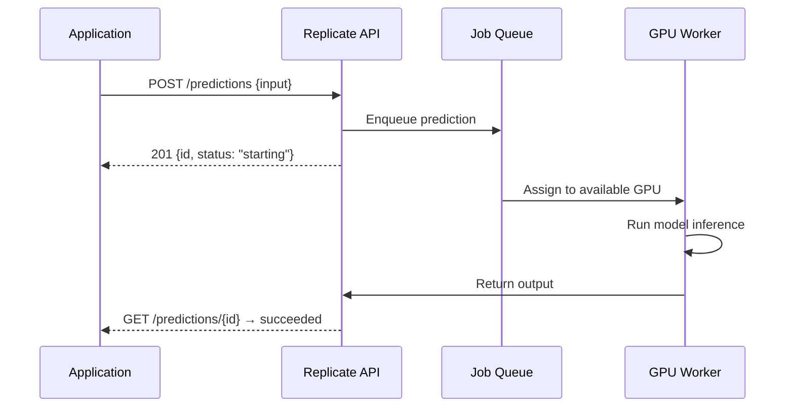

**Category:** AI Model Marketplaces
**Difficulty:** Beginner
**Reading time:** 5 min read

---

Replicate is a cloud platform that lets developers run and publish machine learning models via a simple HTTP API, removing the need to manage GPU infrastructure. Its model explorer provides a searchable catalog of thousands of community-contributed and official models that can be tested in the browser and integrated into applications with a few lines of code.

- **Cog** — Replicate's open-source containerization tool that packages a model's code, weights, and dependencies into a reproducible Docker image
- **Prediction** — a single inference call to a model on Replicate; billed per second of GPU time consumed
- **Version** — an immutable snapshot of a model's Cog container, identified by a SHA-256 hash
- **Cold start** — the latency period when a model container must be loaded onto a GPU before the first prediction
- **Deployment** — a persistent, auto-scaling endpoint for a model that eliminates cold starts
- **Webhook** — an asynchronous callback URL that Replicate calls with prediction results when polling is undesirable

Developers package models using Cog, which wraps a Python `predict()` function and its dependencies into a Docker image. The image is pushed to Replicate's registry with `cog push`, creating a new versioned model entry. Replicate stores the container and provisions it on-demand from its GPU fleet spanning NVIDIA A100, H100, and T4 hardware.

When a prediction is submitted, the API enqueues the job and returns an ID immediately. A background worker pulls the job, cold-starts the container if not already warm (typically 10–60 seconds for large diffusion models), runs inference, and updates the prediction record with outputs. Clients can poll the predictions endpoint or register a webhook for async notification.

The browser-based model explorer lets users test models directly with a form UI generated from the model's input schema. Hot models (frequently requested) are kept warm on dedicated machines, reducing cold start to near zero. Replicate charges per-second of compute time, making it cost-efficient for bursty workloads compared to reserved GPU instances.

- Rapid prototyping with Stable Diffusion variants without GPU setup
- Publishing a research model for community testing alongside an academic paper
- Integrating image generation into a SaaS product using the REST API
- Comparing outputs from multiple fine-tuned language models side by side

| Advantage | Disadvantage |
|-----------|--------------|
| Zero infrastructure management; runs on shared GPU fleet | Cold starts (10–60s) make latency unpredictable for infrequent requests |
| Pay-per-second pricing suits bursty workloads | Per-second GPU costs can exceed reserved instances for sustained workloads |
| Cog standardizes packaging; any Python model is publishable | Cog requires Docker knowledge; complex multi-model pipelines need extra work |

- [Hugging Face Model Hub](hugging-face-model-hub.md)
- [Model Versioning in Marketplaces](model-versioning-in-marketplaces.md)
- [Fine-tuned Model Marketplaces](fine-tuned-model-marketplaces.md)

---
*Part of the [AI Model Marketplaces](index.md) category · [Back to Master Index](../../index.md)*
