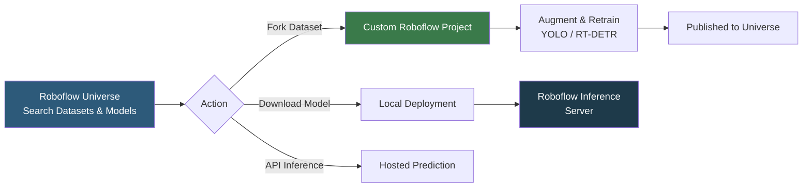

**Category:** AI Model Marketplaces
**Difficulty:** Beginner
**Reading time:** 5 min read

---

Roboflow Universe is the world's largest computer vision dataset and model repository, hosting over 250,000 public datasets and trained models for object detection, segmentation, and classification tasks. It is tightly integrated with the Roboflow platform for dataset annotation, augmentation, and training, making it the primary resource for practitioners building vision AI without large proprietary datasets.

- **Universe dataset** — a publicly shared annotated image dataset on Roboflow, available for fork and use in training
- **Universe model** — a trained model published from a Roboflow project, directly deployable via Roboflow Inference or API
- **Dataset fork** — copying a public Universe dataset into your own Roboflow project for further augmentation, labeling, or combination
- **Roboflow Inference** — the open-source inference server that serves Roboflow-trained models over HTTP
- **Health check** — a Roboflow metric indicating dataset annotation quality (completeness, class balance, annotation consistency)
- **Project type** — the detection task a dataset is structured for: bounding box detection, instance segmentation, classification, or keypoint detection

Roboflow Universe is a social platform for vision AI datasets and models. Users annotate images in Roboflow's labeling tool, configure export formats (YOLO, COCO JSON, Pascal VOC), train models on Roboflow's hosted GPU infrastructure or export datasets to train locally, and optionally publish results to Universe.

Datasets on Universe include the full annotation metadata (bounding boxes, segmentation masks, or class labels), class distribution statistics, and sample images. Users can fork any public dataset into their own project, apply Roboflow's built-in augmentations (flip, rotate, mosaic, blur), and retrain or combine with other datasets.

Published models on Universe are linked to a specific Roboflow dataset version and training configuration, providing reproducibility. These models are deployable via the Roboflow hosted API (submitting a base64-encoded image to the project's prediction endpoint) or self-hosted using the open-source `inference` package.

The search experience supports filtering by object class (e.g., searching "fire extinguisher" returns datasets containing that class), image count, annotation type, and license. This makes Universe particularly valuable for bootstrapping niche vision projects where collecting and annotating custom data would be prohibitively time-consuming.

- Finding an annotated hard-hat dataset to bootstrap a construction site safety detection model
- Forking and combining two Universe datasets to create a more diverse training set
- Deploying a community-trained PCB defect detection model via the Roboflow hosted API
- Publishing a fine-tuned model after a competition to contribute back to the Vision AI community

| Advantage | Disadvantage |
|-----------|--------------|
| Largest computer vision dataset repository; covers many niche domains | Dataset quality varies; annotation errors are common in community-contributed datasets |
| Fork-and-augment workflow significantly accelerates custom model development | Roboflow ecosystem lock-in; datasets are most conveniently used within the Roboflow platform |
| Published models are immediately deployable via hosted API | Hosted inference has per-prediction pricing; high-volume use cases require self-hosted inference |

- [Clarifai Community](clarifai-community.md)
- [Model Performance Benchmarks](model-performance-benchmarks.md)
- [Fine-tuned Model Marketplaces](fine-tuned-model-marketplaces.md)

---
*Part of the [AI Model Marketplaces](index.md) category · [Back to Master Index](../../index.md)*
