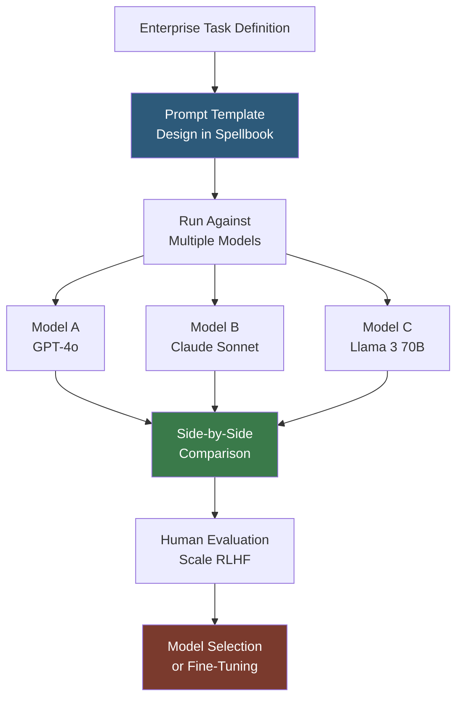

**Category:** AI Model Marketplaces
**Difficulty:** Intermediate
**Reading time:** 5 min read

---

Scale Spellbook (now integrated into Scale AI's broader GenAI platform) is a tool for comparing, evaluating, and deploying large language models side by side. It provides a structured environment for enterprises to benchmark proprietary and open-source models against their specific tasks, enabling data-driven model selection decisions.

- **Model comparison** — Spellbook's core feature for running the same prompt across multiple LLMs simultaneously and comparing outputs
- **Prompt template** — a structured prompt in Spellbook with variable slots for systematic evaluation across input variations
- **Evaluation dataset** — a set of test inputs and expected outputs used to score model performance on domain-specific tasks
- **Scale RLHF** — Scale AI's human feedback annotation pipeline, integrated with Spellbook to generate preference data for fine-tuning
- **Fine-tuning integration** — Spellbook connects to Scale's data labeling platform to bootstrap fine-tuning workflows with human-annotated comparisons
- **Enterprise deployment** — Spellbook provides API access to selected models through Scale's infrastructure with enterprise authentication

Spellbook's workflow begins with a prompt template that captures the structure of a target task (e.g., document summarization, classification, code generation). Users define variables within the template and upload a test dataset of real inputs representative of their production distribution.

The platform runs the prompt template across selected models in parallel, collecting all outputs. Evaluation can be automated (using another LLM as a judge with a scoring rubric) or human-annotated (routing responses to Scale's RLHF annotation pipeline where human raters score quality, accuracy, and style).

Aggregate evaluation results are presented as metrics per model: win rates in pairwise comparisons, task-specific accuracy scores, latency statistics, and cost-per-query estimates. This multi-dimensional scorecard helps teams balance capability, cost, and latency for their specific workload.

When evaluation data reveals that no off-the-shelf model meets requirements, Spellbook integrates with Scale's fine-tuning workflow. Human-annotated preference pairs collected during evaluation become training data for RLHF fine-tuning of smaller, cheaper models that match or exceed larger models on the specific task.

- Running a contract analysis task across GPT-4o, Claude, and Llama to select the most accurate model before committing to an API contract
- Using Scale's RLHF pipeline to collect fine-tuning data from Spellbook evaluation runs
- Benchmarking model latency and cost-per-query alongside accuracy to identify the optimal cost/quality tradeoff
- Comparing model outputs on adversarial or edge-case inputs to identify reliability risks

| Advantage | Disadvantage |
|-----------|--------------|
| Task-specific evaluation is more meaningful than generic benchmarks for production decisions | Scale Spellbook is an enterprise product; pricing is opaque and typically contract-based |
| Integration with Scale RLHF annotation pipeline streamlines fine-tuning data collection | Requires uploading proprietary task examples to Scale's platform, raising data privacy concerns |
| Side-by-side comparison reduces confirmation bias in model selection | The platform is most valuable with significant annotation budget; light evaluation remains shallow |

- [Model Comparison Tools](model-comparison-tools.md)
- [Model Performance Benchmarks](model-performance-benchmarks.md)
- [Model Bias Documentation](model-bias-documentation.md)

---
*Part of the [AI Model Marketplaces](index.md) category · [Back to Master Index](../../index.md)*
