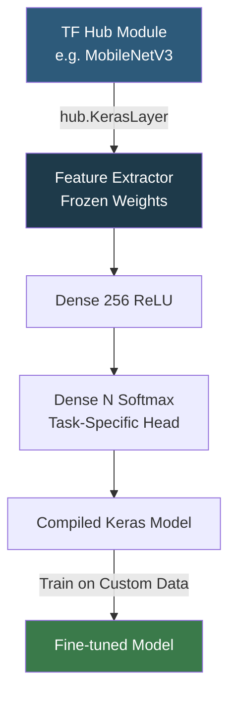

**Category:** AI Model Marketplaces
**Difficulty:** Intermediate
**Reading time:** 5 min read

---

TensorFlow Hub is Google's repository of reusable machine learning modules in the TensorFlow SavedModel and TFLite formats. It focuses on transfer learning — developers load a pretrained feature extractor or text embedding module and add task-specific layers on top, reducing training time from days to hours.

- **SavedModel** — TensorFlow's serialization format that stores the computation graph and weights together, enabling language-agnostic loading
- **TFLite model** — a compressed, quantized model variant optimized for mobile and edge deployment, also hosted on TF Hub
- **Feature vector module** — a Hub module that accepts images (or text) and outputs a fixed-size embedding vector usable as input to a classifier head
- **Fine-tunable module** — a module where the pretrained layers are made trainable during downstream training for higher accuracy at the cost of compute
- **hub.KerasLayer** — a Keras layer wrapper that loads a Hub module and makes it composable with standard Keras layers
- **TFX pipeline** — TensorFlow Extended; Hub modules can be integrated into production ML pipelines as model components

TF Hub modules are loaded by passing a URL string to `hub.load()` or `hub.KerasLayer()`. The library downloads the SavedModel to a local cache directory (`/tmp/tfhub_modules/` by default, overridable via `TFHUB_CACHE_DIR`). The SavedModel includes tf.functions annotated with input signatures, preventing shape mismatches.

Transfer learning with TF Hub follows two phases. In phase one (feature extraction), the Hub module's weights are frozen and only the task-specific head layers are trained. This is fast and requires minimal data. In phase two (fine-tuning), the Hub module is unfrozen and the entire model is trained end-to-end with a low learning rate, improving accuracy when sufficient labeled data is available.

Text embedding modules from TF Hub (e.g., Universal Sentence Encoder) accept string tensors directly, handling tokenization internally. This simplifies NLP pipelines because the preprocessing step is embedded in the module itself, unlike transformer libraries where tokenizers are separate artifacts.

TFLite variants on Hub are quantized (INT8 or FP16) and suitable for deployment on Android/iOS via TensorFlow Lite, or on microcontrollers via TensorFlow Micro.

- Building an image classifier for a custom dataset by fine-tuning EfficientNet from TF Hub
- Adding semantic search to an application using Universal Sentence Encoder embeddings
- Deploying a MobileNet object detection model to Android using the TFLite variant from Hub
- Integrating a text preprocessing module into a TFX production pipeline

| Advantage | Disadvantage |
|-----------|--------------|
| hub.KerasLayer makes Hub modules composable with standard Keras workflows | Catalog is primarily TensorFlow-specific; not usable in PyTorch environments |
| Internal preprocessing in modules (e.g., tokenization) simplifies pipelines | Fewer cutting-edge models compared to Hugging Face Hub; updates can lag |
| TFLite variants provide a direct path to mobile deployment | SavedModel format can be opaque; debugging model internals is harder |

- [PyTorch Hub](pytorch-hub.md)
- [ONNX Model Zoo](onnx-model-zoo.md)
- [Hugging Face Model Hub](hugging-face-model-hub.md)

---
*Part of the [AI Model Marketplaces](index.md) category · [Back to Master Index](../../index.md)*
