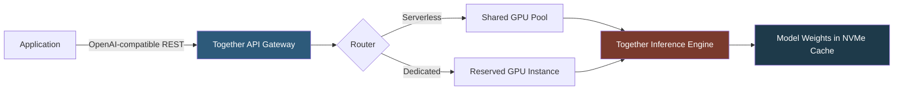

**Category:** AI Model Marketplaces
**Difficulty:** Intermediate
**Reading time:** 6 min read

---

Together.ai is a cloud inference platform offering a curated library of open-source foundation models accessible through an OpenAI-compatible API. It specializes in high-throughput, low-latency LLM inference using custom GPU clusters and the Together Inference Engine, making it a cost-effective alternative to hosting models independently.

- **Together Inference Engine** — Together's proprietary inference stack optimized for throughput using continuous batching and custom CUDA kernels
- **OpenAI-compatible API** — Together's endpoint mirrors OpenAI's `/chat/completions` and `/completions` schemas, enabling drop-in replacement
- **Fine-tuning jobs** — Together provides a serverless fine-tuning API that trains LoRA adapters on its GPU cluster and registers the result in the model library
- **Serverless endpoint** — an auto-scaling inference endpoint with per-token billing and no reserved instance commitment
- **Dedicated endpoint** — a reserved GPU allocation for a specific model ensuring consistent latency
- **Continuous batching** — a scheduling technique that interleaves requests mid-generation to maximize GPU utilization

Together's model library catalogs dozens of open-weight models including Llama 3, Mistral, Mixtral, Qwen, DeepSeek, and domain-specific variants. Models are pre-loaded on Together's GPU clusters (primarily NVIDIA A100 and H100 nodes) with weights cached on NVMe SSDs for fast cold-start.

The Together Inference Engine implements PagedAttention (from vLLM) for memory-efficient KV-cache management, continuous batching to process multiple requests simultaneously, and custom CUDA fused kernels that reduce memory bandwidth bottlenecks. This allows Together to serve large models like Llama 3 70B at token generation rates of 80–150 tokens/second per request.

Pricing follows a per-million-token model. Input tokens are charged separately from output tokens because output generation is compute-intensive (autoregressive) while input processing is parallelizable. The OpenAI-compatible schema means existing applications using the `openai` Python SDK can switch to Together by changing the `base_url` and API key — no code refactoring required.

Fine-tuning via the API submits a JSONL training file, selects a base model and LoRA rank, and Together trains and registers the adapter, returning a custom model ID usable in subsequent inference calls.

- Replacing OpenAI with an open-weight model to reduce cost while keeping the same API contract
- Running A/B tests between Llama and Mistral variants using the same application code
- Fine-tuning a domain-specific model on proprietary data without managing GPU infrastructure
- Building latency-sensitive chatbots using dedicated endpoints with reserved GPU capacity

| Advantage | Disadvantage |
|-----------|--------------|
| OpenAI-compatible API minimizes migration effort | Model selection limited to Together's curated catalog |
| Per-token pricing is cost-effective for moderate workloads | Very high throughput may be cheaper on owned/reserved GPU hardware |
| High throughput inference engine outperforms naive vLLM deployments | Proprietary inference engine limits debugging transparency |

- [Hugging Face Model Hub](hugging-face-model-hub.md)
- [Model Performance Benchmarks](model-performance-benchmarks.md)
- [Commercial vs Open-Source Models](commercial-vs-open-source-models.md)

---
*Part of the [AI Model Marketplaces](index.md) category · [Back to Master Index](../../index.md)*
