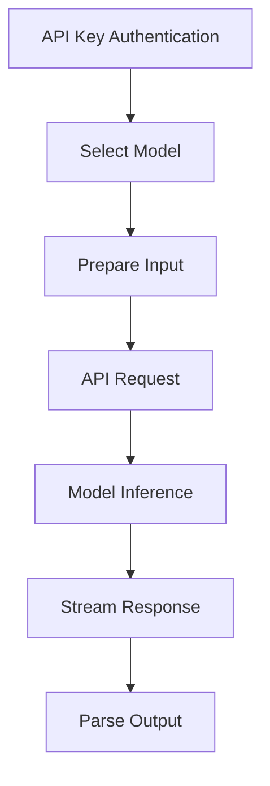

**Category:** AI Model Marketplaces
**Difficulty:** Intermediate
**Reading time:** 6 min read

---

Together.ai's model library provides access to dozens of open-source and proprietary large language models through a unified API. It enables researchers and developers to compare model performance, fine-tune models, and deploy inference at scale without maintaining separate integrations.

- **Model Variety** — Access to diverse open-source and proprietary LLMs
- **Unified API** — Single interface across different model providers
- **Fine-tuning as a Service** — Training models on custom datasets
- **Cost Optimization** — Comparing model costs and latency trade-offs
- **Batch Processing** — Efficient processing of large document collections

Developers authenticate with API credentials and select from available models (Meta Llama, Mistral, Falcon, etc.). The unified API accepts prompts with parameters (temperature, max_tokens). Together.ai routes requests to appropriate inference infrastructure, managing load balancing and scaling. Responses stream back in real-time, enabling responsive applications. The platform abstracts hardware details—developers don't need to manage GPUs. Fine-tuning APIs allow training on custom datasets, with results available for deployment. Batch endpoints process large document collections asynchronously, optimizing cost.

- Research and experimentation with multiple LLMs
- Cost-effective LLM inference without self-hosting
- Fine-tuning models on domain-specific data
- Comparing model performance and latency
- Building applications supporting multiple model backends
- Processing large document collections at scale

| Advantage | Disadvantage |
|-----------|--------------|
| Easy model comparison and switching | API cost per token usage |
| No infrastructure management | Less control than self-hosted models |
| Rapid experimentation with models | Vendor lock-in to platform |
| Integrated fine-tuning service | Latency from external API calls |
| Strong open-source model selection | Limited proprietary models |

- [OpenAI Model API](../model-api/openai-model-api.md)
- [Model Deployment Services](../deployment/model-deployment-services.md)
- [LLM Fine-tuning Platforms](../optimization/llm-fine-tuning-platforms.md)

---
*Part of the [AI Model Marketplaces](index.md) category · [Back to Master Index](../../index.md)*
