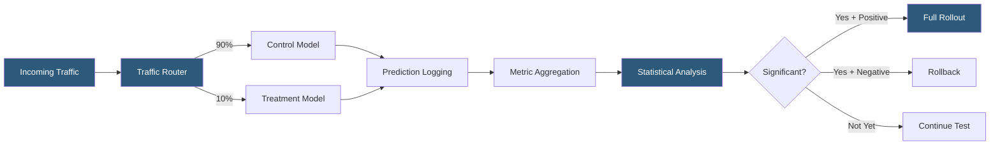

**Category:** AI Model Monitoring & Observability
**Difficulty:** Intermediate
**Reading time:** 6 min read

---

A/B testing for ML models routes a percentage of live production traffic to competing model variants and statistically compares their performance on business and quality metrics. It provides the most ecologically valid evidence for model selection decisions by measuring impact on actual users rather than offline evaluation datasets.

- **Treatment** — the new model version being tested against the existing production model
- **Control** — the current production model serving as the baseline comparison
- **Traffic split** — the percentage of requests routed to treatment versus control, typically starting at 1-5% treatment for risk mitigation
- **Online metric** — business KPI measured in real-time from production traffic (click-through rate, purchase conversion, user satisfaction score)
- **Minimum detectable effect (MDE)** — the smallest metric improvement the test is designed to detect with statistical confidence given the traffic volume and variance
- **Statistical significance** — confidence that the observed metric difference between variants is not due to random chance, typically requiring p < 0.05
- **Guardrail metric** — secondary metric (error rate, latency) that must not degrade significantly even if the primary metric improves

ML model A/B tests require infrastructure that deterministically routes the same user to the same model variant across multiple requests (sticky assignment) to prevent within-user inconsistency. User or session IDs are hashed with the experiment ID to produce a consistent bucket assignment, ensuring users in the treatment group always receive the treatment model throughout the test.

Traffic allocation begins conservatively—typically 1-5% treatment traffic—to minimize user exposure to an unvalidated model. As monitoring shows no guardrail metric violations (error rate, latency, critical failure rate), traffic is ramped up gradually (5% → 10% → 25% → 50%) using feature flag or traffic management tooling.

Sample size requirements are calculated using power analysis before the test begins. Given the baseline metric value, expected improvement (MDE), desired significance level (α = 0.05), and power (1-β = 0.8), the required number of observations per variant is computed. Tests running before this sample size is reached risk underpowered conclusions.

Statistical analysis uses different methods depending on metric type: two-proportion Z-test for binary outcomes (conversion rate), Welch's t-test for continuous outcomes (revenue per user), and Mann-Whitney U test for non-normal continuous distributions (latency). Bootstrap confidence intervals provide robust estimates when distributional assumptions are unclear.

Multi-metric evaluation complicates decision-making: a model might improve click-through rate but degrade session duration. Decision frameworks pre-specify which metrics are primary (the test succeeds if these improve), which are secondary (improvements are noted but not decisive), and which are guardrails (the test fails if these degrade beyond tolerance regardless of primary metrics).

- Validating that a fine-tuned recommendation model improves purchase conversion before full rollout
- Testing two LLM prompt templates by routing traffic to each and comparing user satisfaction ratings
- Measuring the business impact of upgrading from a smaller to a larger model on downstream revenue metrics
- Progressive model rollouts using A/B traffic allocation to control exposure risk
- Fairness testing: verifying that a new model version doesn't differentially impact protected demographic groups

| Advantage | Disadvantage |
|-----------|--------------|
| Live traffic provides the most ecologically valid metric evidence | Requires sufficient traffic volume to reach statistical significance within practical time windows |
| Progressive traffic ramping limits user exposure to unvalidated model variants | Sticky user assignment adds routing infrastructure complexity |
| Multi-metric guardrails protect against regressions on non-primary KPIs | Interaction effects between concurrent A/B tests require careful experiment isolation |
| Business metric optimization provides direct evidence for ROI conversations | Long-running tests expose users to potentially worse experiences if treatment underperforms |

- [Shadow Model Deployment](shadow-model-deployment.md)
- [Champion-Challenger Testing](champion-challenger-testing.md)
- [Model Version Comparison](model-version-comparison.md)

---
*Part of the [AI Model Monitoring & Observability](index.md) category · [Back to Master Index](../../index.md)*
