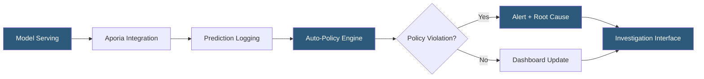

**Category:** AI Model Monitoring & Observability
**Difficulty:** Intermediate
**Reading time:** 6 min read

---

Aporia is an ML monitoring platform designed for production model observability with a focus on ease of integration and investigative tooling. It provides automated monitoring policies, root cause analysis, and an exploration interface that helps ML teams diagnose production issues without requiring deep platform expertise.

- **Aporia Policies** — auto-generated monitoring rules inferred from model characteristics and data distributions at registration time
- **Investigation mode** — interactive query interface enabling ad-hoc slicing and analysis of production prediction data
- **Model version comparison** — side-by-side metric comparison between deployed model versions to assess upgrade impact
- **Custom segments** — user-defined population filters applied to monitoring metrics for cohort-specific analysis
- **Integration Hub** — pre-built connectors for Databricks, SageMaker, Seldon, BentoML, and other serving platforms
- **Prediction store** — queryable database of all logged predictions enabling historical lookback and trend analysis
- **Explainability snapshot** — per-prediction feature importance captured at inference time for investigation use

Aporia's setup process begins at model registration, where the platform ingests schema information and a baseline dataset. It automatically inspects feature distributions and model type to generate a default set of monitoring policies covering data quality, drift, and performance checks. This "zero-config" onboarding reduces time-to-monitoring from days to hours for standard use cases.

The Integration Hub provides framework-specific connectors that inject Aporia's logging code into common serving environments without requiring manual SDK integration. For Databricks model serving, Aporia connects through MLflow model signatures; for SageMaker, through endpoint invocation logging; for containerized models, through a sidecar proxy pattern.

Prediction logging captures inputs, outputs, model version, serving endpoint, and optional custom metadata tags. Aporia indexes all logged predictions in a columnar store optimized for analytical queries, enabling investigation queries like "show me all predictions where feature X was above 90th percentile and the model output a positive class."

The root cause analysis module, triggered automatically on alert, performs statistical correlation analysis between the alert metric and individual feature shifts. It ranks features by correlation with the monitored metric degradation and presents a ranked list of candidate root causes with supporting statistical evidence.

Model version comparison enables controlled rollouts: deploying a new model to a shadow or canary slice and comparing its prediction distributions, accuracy (when ground truth is available), and feature importance patterns against the current production model before full promotion.

- Rapid production monitoring setup for a team without dedicated MLOps infrastructure
- Investigating a model performance dip by querying prediction data across time and feature slices
- Comparing prediction distributions between a current production model and a canary deployment
- Setting up monitoring for a team's first ML model in production using auto-generated policies
- Auditing model behavior across geographic segments to identify regional performance disparities

| Advantage | Disadvantage |
|-----------|--------------|
| Auto-generated policies reduce monitoring setup time for standard use cases | Default policies may not capture domain-specific quality requirements without customization |
| Investigation interface enables non-engineers to query prediction data interactively | Platform subscription required; open-source alternative requires building investigation tooling |
| Integration Hub reduces framework-specific integration complexity | Pre-built connectors may not cover custom or less common serving frameworks |
| Columnar prediction store enables fast analytical queries over production data | Storing raw predictions raises data governance considerations for PII-containing features |

- [Arthur Model Monitoring](arthur-model-monitoring.md)
- [Evidently AI Monitoring](evidently-ai-monitoring.md)
- [Censius AI Observability](censius-ai-observability.md)

---
*Part of the [AI Model Monitoring & Observability](index.md) category · [Back to Master Index](../../index.md)*
