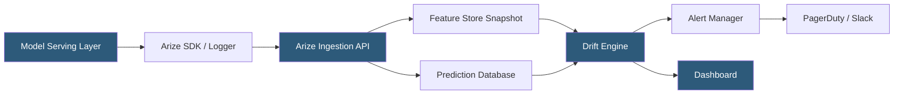

**Category:** AI Model Monitoring & Observability
**Difficulty:** Intermediate
**Reading time:** 6 min read

---

Arize AI is a dedicated ML observability platform that provides real-time monitoring, drift detection, and root cause analysis for machine learning models in production. It integrates directly with model serving infrastructure to capture predictions, ground truth labels, and feature distributions without requiring application-level code changes.

- **Prediction logging** — automatic capture of model inputs, outputs, and associated metadata for every inference request
- **Ground truth ingestion** — delayed binding of actual outcome labels to previously logged predictions for accuracy calculation
- **Feature drift** — statistical divergence between the feature distributions observed in training versus production
- **Performance degradation alerting** — threshold-based notifications when model accuracy, precision, or recall metrics fall below acceptable bounds
- **Slice analysis** — disaggregated performance evaluation across cohorts defined by feature values or metadata attributes
- **Embedding visualization** — dimensionality reduction (UMAP/t-SNE) of model embedding spaces to identify distribution shifts in unstructured data
- **Tracing** — end-to-end request tracing for LLM chains and multi-step inference pipelines

Arize integrates through a lightweight Python SDK that wraps model serving code. At inference time, the SDK asynchronously logs a prediction record containing input features, model output, prediction ID, and optional metadata tags. These records are batched and sent to Arize's ingestion API with minimal latency impact—typically under 5ms overhead per request for the async logging path.

The platform maintains a statistical baseline established from training data or a designated reference window. For numeric features, Arize computes Population Stability Index (PSI) and Jensen-Shannon divergence against this baseline on a configurable schedule (hourly, daily). For categorical features it uses chi-squared tests. Embedding drift for NLP models is detected through cosine similarity degradation in embedding space or Euclidean distance in UMAP-reduced projections.

Ground truth labels arrive with a delay matching the business process (hours for fraud detection, days for click-through predictions). Arize binds delayed labels to historical prediction records by prediction ID, enabling retrospective accuracy calculation that drives performance alerts.

For LLMs, Arize Phoenix (the open-source observability layer) captures token-level traces, evaluates responses with LLM-as-judge scoring, and tracks prompt template versions—providing observability across the full chain from prompt construction through retrieval augmentation to generation.

Slice analysis surfaces performance disparities across feature cohorts without manual investigation. The platform automatically identifies feature segments where model performance deviates most from the aggregate, accelerating root cause identification for production degradation incidents.

- Monitoring a fraud detection model for distribution shifts as fraudster behavior evolves
- Tracking LLM response quality metrics and hallucination rates in production
- Setting automated alerts when model accuracy drops below contractual SLA thresholds
- Investigating root cause of a production degradation event using slice analysis
- Comparing prediction distributions between model versions during a canary deployment

| Advantage | Disadvantage |
|-----------|--------------|
| Async logging minimizes inference latency impact | Ground truth delays mean real-time accuracy calculation is not always possible |
| Pre-built drift detection algorithms reduce MLOps development time | Platform lock-in; migrating monitoring data to another system requires export |
| LLM-specific tooling (Phoenix) addresses GenAI observability gaps | Cost scales with prediction volume; high-frequency serving can be expensive to monitor |
| Automated slice analysis reduces manual investigation effort | Complex multi-model pipelines require custom SDK integration across each service |

- [Arize Model Monitoring](arize-model-monitoring.md)
- [Arize Drift Detection](arize-drift-detection.md)
- [Evidently AI Monitoring](evidently-ai-monitoring.md)

---
*Part of the [AI Model Monitoring & Observability](index.md) category · [Back to Master Index](../../index.md)*
