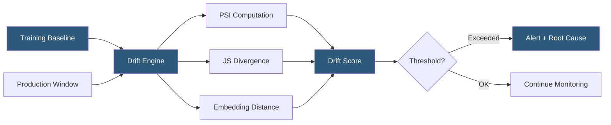

**Category:** AI Model Monitoring & Observability
**Difficulty:** Advanced
**Reading time:** 7 min read

---

Arize drift detection automatically identifies statistical changes in model input features and prediction distributions that indicate degraded model relevance. It supports multiple drift detection algorithms applicable to numeric, categorical, and high-dimensional embedding data, enabling early warning before accuracy degradation becomes measurable.

- **Population Stability Index (PSI)** — industry-standard metric comparing two distributions; PSI < 0.1 stable, 0.1–0.2 moderate shift, >0.2 significant shift
- **Jensen-Shannon divergence** — symmetrized information-theoretic distance between probability distributions; bounded between 0 and 1
- **Kullback-Leibler divergence** — asymmetric measure of how one distribution differs from a reference distribution; used for continuous feature comparison
- **Euclidean distance drift** — drift measurement in embedding space using L2 distance between centroid positions across time windows
- **Prediction drift** — shift in the distribution of model output scores or class probabilities, independent of ground truth labels
- **Covariate shift** — change in the marginal distribution of input features P(X) without a corresponding change in P(Y|X)
- **Concept drift** — change in the relationship between inputs and target variable P(Y|X), requiring model retraining rather than data recalibration

Arize establishes drift baselines from training dataset statistics uploaded at model deployment time or from a designated historical production window. For numeric features, the platform computes binned distributions (typically 10–20 equal-frequency bins) of the baseline data and stores the bucket boundaries. At each evaluation cycle, production feature values are binned using the same boundaries and compared against the stored baseline distribution using PSI.

For categorical features, PSI is computed across category frequency distributions. New categories appearing in production that were absent from training receive special handling—their presence is flagged as a categorical drift signal regardless of PSI score, since unseen categories can cause silent model failures if one-hot encoding or embedding lookups don't handle unknown values.

Embedding drift detection addresses the challenge of measuring drift in high-dimensional unstructured data (text, image, or audio embeddings). Arize computes UMAP projections of embedding vectors and tracks centroid migration and intra-cluster variance over time. A significant shift in the UMAP space indicates the model is receiving inputs that differ structurally from its training distribution, even when the input text may appear superficially similar.

Root cause analysis for drift events is automated: when PSI exceeds the alert threshold, Arize identifies the top-contributing features by ranking their individual PSI contributions. The platform also checks for correlation shifts—features whose joint distribution changes even when individual marginal distributions appear stable—which can indicate confounded covariate shift.

Drift alerts are enriched with example prediction records from the high-drift region, enabling engineers to inspect the actual production data causing the distribution shift rather than working from statistics alone.

- Detecting demographic shift in a user base causing input feature distributions to diverge from training data
- Identifying upstream data pipeline failures through sudden categorical drift in previously stable features
- Monitoring embedding space drift in a document classification model as new document types appear
- Catching concept drift in a demand forecasting model after a major market disruption
- Triggering automated retraining pipelines when PSI exceeds 0.2 on critical features

| Advantage | Disadvantage |
|-----------|--------------|
| PSI is interpretable and widely understood by ML and data teams | Statistical tests have a lag; early-stage drift may not breach thresholds immediately |
| Multiple algorithm options suit different feature types and data distributions | Baseline selection significantly impacts drift scores; stale baselines cause false positives |
| Embedding drift detection extends coverage to unstructured data | High-dimensional drift detection requires significant compute for large embedding models |
| Automated root cause attribution reduces investigation time | Covariate shift detection does not distinguish benign distributional changes from harmful ones |

- [Arize Model Monitoring](arize-model-monitoring.md)
- [Model Drift Detection](model-drift-detection.md)
- [Data Drift Analysis](data-drift-analysis.md)

---
*Part of the [AI Model Monitoring & Observability](index.md) category · [Back to Master Index](../../index.md)*
