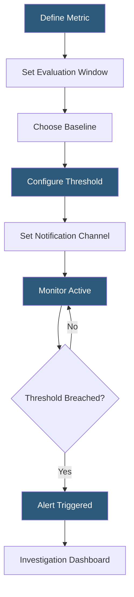

**Category:** AI Model Monitoring & Observability
**Difficulty:** Intermediate
**Reading time:** 6 min read

---

Arize model monitoring provides continuous evaluation of deployed ML model behavior by tracking prediction distributions, performance metrics, and data quality signals. It operationalizes the feedback loop between model production behavior and the development cycle by surfacing actionable degradation signals before they impact business outcomes.

- **Monitor** — a configured rule combining a metric, evaluation window, baseline, and alert threshold
- **Evaluation window** — rolling time period (1 hour to 30 days) over which metrics are computed
- **Baseline** — reference distribution (training data snapshot or historical production window) against which current behavior is compared
- **Accuracy monitor** — tracks classification accuracy, AUROC, or regression RMSE as ground truth labels arrive
- **Data quality monitor** — flags missing values, out-of-range inputs, type mismatches, or schema violations in incoming feature data
- **Volume monitor** — detects prediction request volume anomalies indicating upstream issues or traffic spikes
- **Custom metric monitor** — user-defined metric calculations over logged prediction data for business-specific KPIs

Arize organizes monitoring through a Monitor entity that encapsulates all configuration for a single tracked concern. Creating a monitor requires specifying the model, environment (training/validation/production), the metric to track (e.g., PSI for feature drift, F1 for performance), the evaluation window, the comparison baseline, and alert thresholds with warning and critical severity levels.

The platform evaluates monitors on a scheduled cadence: hourly for near-real-time drift detection, and triggered upon ground truth ingestion for performance monitors. For drift monitors, Arize computes the PSI between the baseline feature distribution and the current evaluation window. PSI values above 0.1 indicate moderate drift; above 0.2 indicates significant drift requiring investigation.

Performance monitors use a different workflow because they depend on ground truth labels that arrive asynchronously. As labels are ingested via batch upload or streaming API, the platform retroactively computes accuracy metrics for the corresponding prediction window. Time-delayed accuracy curves are displayed alongside prediction volume to help distinguish genuine model degradation from ground truth labeling lag artifacts.

Arize supports multi-dimensional monitors that track metrics across feature slices simultaneously. For example, a fraud model might have separate performance thresholds for high-value transactions versus standard transactions, recognizing that the model's behavior on different cohorts may degrade independently.

Alert routing integrates with PagerDuty, Slack, email, and webhooks, enabling on-call engineers to receive contextualized degradation notifications with direct links to the relevant investigation dashboard. Auto-generated explanations summarize which features or cohorts drove the threshold breach, reducing mean time to diagnosis.

- Setting up hourly PSI monitors on top-10 feature importance features for a credit scoring model
- Alerting on precision degradation for a medical diagnosis classifier when accuracy drops below 92%
- Detecting sudden increases in null value rates indicating an upstream data pipeline failure
- Monitoring prediction volume for anomaly detection—a 50% drop may indicate a silent API error
- Tracking custom business metrics (revenue at risk from model predictions) alongside standard ML metrics

| Advantage | Disadvantage |
|-----------|--------------|
| Configurable monitor types cover drift, performance, and data quality in one platform | Monitor configuration complexity increases rapidly for models with many features |
| Slice-aware monitoring surfaces cohort-specific degradation invisible in aggregate | Performance monitoring requires ground truth ingestion pipeline setup and maintenance |
| Alert routing integrations reduce MTTR through contextual notifications | High-sensitivity thresholds generate alert fatigue; calibration requires tuning |
| Volume anomaly monitoring catches infrastructure issues complementing model-specific signals | Platform subscription cost scales with prediction volume logged |

- [Arize AI Observability Platform](arize-ai-observability-platform.md)
- [Arize Drift Detection](arize-drift-detection.md)
- [Model Performance Degradation](model-performance-degradation.md)

---
*Part of the [AI Model Monitoring & Observability](index.md) category · [Back to Master Index](../../index.md)*
