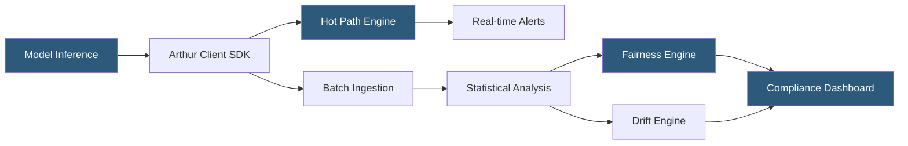

**Category:** AI Model Monitoring & Observability
**Difficulty:** Intermediate
**Reading time:** 6 min read

---

Arthur AI is an enterprise model monitoring platform with a strong focus on fairness, explainability, and performance monitoring for high-stakes AI deployments. It provides real-time and batch monitoring capabilities with built-in bias detection making it suitable for regulated industries including finance, healthcare, and insurance.

- **Arthur Bench** — open-source LLM evaluation framework for comparing model outputs across quality dimensions
- **Fairness monitoring** — automated detection of disparate model impact across protected demographic attributes
- **Hot path monitoring** — real-time inference monitoring with sub-second alert latency for time-sensitive applications
- **Cold path monitoring** — asynchronous batch analysis of historical prediction windows for deeper statistical analysis
- **Group fairness metric** — statistical parity, equalized odds, or predictive parity measurements across demographic segments
- **Enrichment** — process of augmenting logged predictions with derived features (e.g., demographic proxies) for fairness analysis
- **Inference feedback** — ground truth labels provided back to Arthur to enable accuracy performance monitoring

Arthur operates through a dual-path architecture. The hot path processes prediction events in near-real-time using a streaming pipeline, enabling sub-second alerting on data quality violations or prediction distribution anomalies. This path is optimized for latency-sensitive applications where early detection is critical. The cold path handles batch uploads and runs more computationally intensive analyses (fairness metrics, detailed drift analysis) asynchronously.

Fairness monitoring is Arthur's most differentiated capability. The platform computes multiple group fairness metrics simultaneously: Statistical Parity Difference (difference in positive prediction rates across groups), Equal Opportunity (true positive rate parity), and Calibration Within Groups (accuracy parity). Users configure which demographic attributes to analyze and which fairness criterion applies to their regulatory context.

For financial services applications subject to the Equal Credit Opportunity Act or Fair Housing Act, Arthur generates model performance reports disaggregated by protected class proxies. Importantly, the platform supports proxy variable analysis—since models can produce disparate impact without explicitly using protected attributes, Arthur monitors feature proxies (zip code, names, loan type) that may encode demographic information.

Arthur Bench addresses LLM evaluation specifically: it provides a framework for running standardized summarization, question-answering, and hallucination tests against LLM deployments, comparing outputs from different model versions or prompt templates. Evaluations run as automated test suites in CI/CD pipelines, catching LLM quality regressions before promotion.

Integration options include REST API logging, Python SDK, batch CSV/Parquet uploads, and connectors for SageMaker, Vertex AI, and Azure ML.

- Financial institutions monitoring mortgage approval models for Fair Housing Act compliance
- Insurance companies detecting disparate impact in claims processing ML models
- Healthcare providers monitoring clinical risk scores across patient demographic segments
- Enterprises running Arthur Bench LLM evaluations as pre-deployment quality gates
- Regulated industries requiring audit-ready model performance documentation with fairness metrics

| Advantage | Disadvantage |
|-----------|--------------|
| Built-in fairness metrics reduce custom development for compliance monitoring | Fairness metric computation requires demographic data that may raise its own privacy concerns |
| Dual hot/cold path architecture balances real-time alerting with deep analysis | Enterprise platform complexity exceeds requirements for simple ML applications |
| Arthur Bench provides structured LLM evaluation framework at no additional cost | Ground truth requirement for accuracy monitoring adds operational overhead |
| Regulatory-ready reporting reduces custom compliance tooling development | Proxy variable fairness analysis requires domain expertise to configure meaningfully |

- [Fiddler AI Observability](fiddler-ai-observability.md)
- [Model Drift Detection](model-drift-detection.md)
- [Champion-Challenger Testing](champion-challenger-testing.md)

---
*Part of the [AI Model Monitoring & Observability](index.md) category · [Back to Master Index](../../index.md)*
