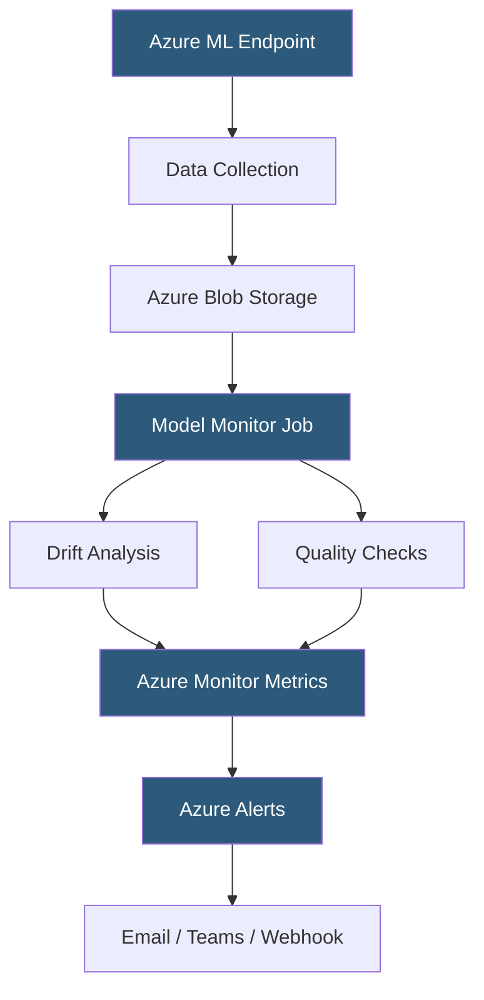

**Category:** AI Model Monitoring & Observability
**Difficulty:** Advanced
**Reading time:** 6 min read

---

Azure Machine Learning model monitoring provides continuous evaluation of deployed models within the Azure ML ecosystem, integrating with Azure Monitor, Application Insights, and the Azure ML model registry to deliver end-to-end observability for production ML workloads.

- **Model monitor** — Azure ML resource configuring which metrics to track, the baseline dataset, and alert thresholds
- **Data drift** — Azure ML drift metric measuring distribution change in production data relative to the training baseline
- **Prediction drift** — monitoring of model output distribution changes independent of ground truth label availability
- **Data quality** — Azure ML checks for missing values, out-of-range values, and type violations in production features
- **Feature attribution drift** — changes in SHAP-based feature importance in production versus training
- **Monitoring signal** — individual tracked metric type (data drift, prediction drift, data quality, or custom)
- **Azure Monitor integration** — publishing of monitoring metrics to Azure Monitor for unified operational alerting with non-ML Azure resources

Azure ML model monitoring integrates with online endpoints (managed real-time serving) and batch endpoints deployed within the Azure ML workspace. Production traffic data is collected to Azure Blob Storage using endpoint data collection configuration, specifying the percentage of requests to capture and the destination storage container.

Model monitor resources are defined declaratively in YAML or Python SDK, specifying the model, production data location, baseline dataset reference, monitoring signals, and alert thresholds. Monitoring jobs run as Azure ML jobs on a configured schedule (typically hourly or daily), executing the drift and quality analysis against the collected production window data.

The platform computes Jensen-Shannon distance for numeric features and normalized Wasserstein distance for categorical features, comparing production windows to the training baseline. Threshold values default to 0.1 (alert warning) and 0.5 (alert critical) for JS distance, configurable per feature.

Azure Monitor integration is a significant operational advantage for organizations already standardized on Azure observability: monitoring signals are published as custom Azure Monitor metrics alongside application, infrastructure, and business metrics. This enables unified alerting rules that trigger on combinations of ML model degradation and application health signals—for example, alerting when both model accuracy drops AND API error rate increases.

Feature attribution drift monitoring uses the Azure ML Responsible AI toolbox (SHAP-based) to compute production feature importances and compare against training importances. This catches cases where a feature that was critical during training becomes less predictive in production, indicating concept drift even before accuracy metrics degrade.

- Enterprises standardized on Azure monitoring infrastructure wanting unified ML and application monitoring
- Models deployed on Azure ML managed endpoints with automatic data collection integration
- Combining model quality alerts with Azure DevOps pipelines to trigger automated retraining
- Feature attribution drift monitoring to detect early-stage concept drift before accuracy degrades
- Multi-signal alerting combining model drift, application errors, and infrastructure metrics in Azure Monitor

| Advantage | Disadvantage |
|-----------|--------------|
| Native Azure Monitor integration unifies ML and operational observability | Tightly coupled to Azure ML endpoints; not practical for models deployed outside Azure |
| Declarative YAML configuration enables infrastructure-as-code monitoring setup | Job-based monitoring has schedule latency; not suitable for streaming real-time detection |
| Responsible AI integration provides consistent bias and attribution analysis | Feature attribution monitoring requires Responsible AI toolbox configuration complexity |
| Azure ecosystem integration reduces vendor proliferation for Azure-native organizations | Configuration requires deep Azure ML ecosystem knowledge to set up correctly |

- [SageMaker Model Monitor](sagemaker-model-monitor.md)
- [Vertex AI Model Monitoring](vertex-ai-model-monitoring.md)
- [Weights & Biases Model Monitoring](weights-biases-model-monitoring.md)

---
*Part of the [AI Model Monitoring & Observability](index.md) category · [Back to Master Index](../../index.md)*
