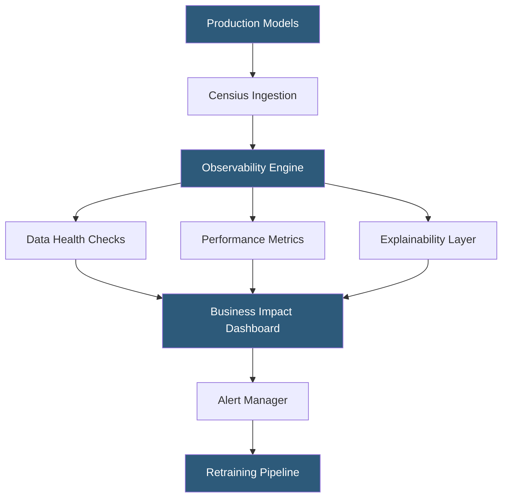

**Category:** AI Model Monitoring & Observability
**Difficulty:** Intermediate
**Reading time:** 5 min read

---

Censius is an enterprise AI observability platform providing end-to-end visibility into ML model performance, data health, and business impact alignment. It emphasizes connecting model monitoring metrics to downstream business KPIs, enabling organizations to understand the operational and financial consequences of model behavior changes.

- **Business metric correlation** — linkage between model performance metrics and downstream business outcomes (revenue, conversion, churn) tracked jointly
- **Explainability-driven monitoring** — surfacing feature contribution analysis alongside performance metrics to accelerate root cause identification
- **Schema drift** — detection of structural changes in incoming data (new columns, removed columns, type changes) distinct from distributional drift
- **Model performance scorecard** — consolidated view of multiple performance metrics rated against defined acceptable ranges
- **Monitoring workflow** — automated response sequence triggered on alert, including investigation steps and escalation paths
- **Data lineage tracking** — tracing predictions back through feature engineering and data sourcing steps to identify upstream issues
- **Retraining trigger** — automated signal sent to ML pipelines when monitoring thresholds indicate the model requires updating

Censius integrates with serving infrastructure through an SDK and REST API supporting both real-time prediction logging and batch uploads. The platform ingests prediction records, enriches them with derived features from its explainability engine, and stores them in a queryable prediction store.

The business impact correlation feature distinguishes Censius from pure technical monitoring platforms. Users configure business outcome metrics (order completion rate, ad click-through, patient readmission) and link them to their associated models. The platform then tracks both ML metrics and business metrics in a unified dashboard, automatically flagging when ML metric changes correlate with business metric movements. This enables teams to prioritize monitoring alerts by business impact rather than treating all technical degradation events equally.

Schema drift detection monitors incoming data structure: new feature columns appearing, required columns missing, or feature data types changing. These structural changes often precede distribution drift and can indicate upstream system changes that require model or serving layer updates.

The retraining trigger capability integrates with MLflow, Kubeflow, and SageMaker Pipelines. When configured drift or performance thresholds are breached, Censius sends a webhook or direct pipeline invocation to the configured retraining system, enabling fully automated model refresh cycles with monitoring-driven trigger conditions.

Censius provides a visual lineage graph showing the path from data sources through feature transformations to model predictions, enabling engineers to trace a production anomaly upstream to its originating data system.

- Connecting a recommendation model's drift metrics to revenue per user to quantify business impact
- Detecting schema changes in upstream data pipelines before they cause silent model failures
- Automating retraining pipeline triggers when model drift exceeds operational thresholds
- Building executive dashboards that show model health in business terms rather than technical metrics
- Data lineage investigation tracing a prediction anomaly to a specific upstream data pipeline failure

| Advantage | Disadvantage |
|-----------|--------------|
| Business metric correlation makes technical monitoring accessible to non-ML stakeholders | Requires integration with business metric data sources adding configuration complexity |
| Automated retraining triggers reduce manual operations overhead | Automated retraining without human review can propagate data quality issues to new models |
| Schema drift detection catches structural issues before distributional analysis | Data lineage tracking requires instrumentation across multiple pipeline stages |
| Unified dashboard reduces context switching between technical and business monitoring tools | Platform differentiation claims around business impact correlation require careful validation |

- [Aporia ML Monitoring](aporia-ml-monitoring.md)
- [Superwise Model Monitoring](superwise-model-monitoring.md)
- [Real-time Monitoring Dashboards](real-time-monitoring-dashboards.md)

---
*Part of the [AI Model Monitoring & Observability](index.md) category · [Back to Master Index](../../index.md)*
