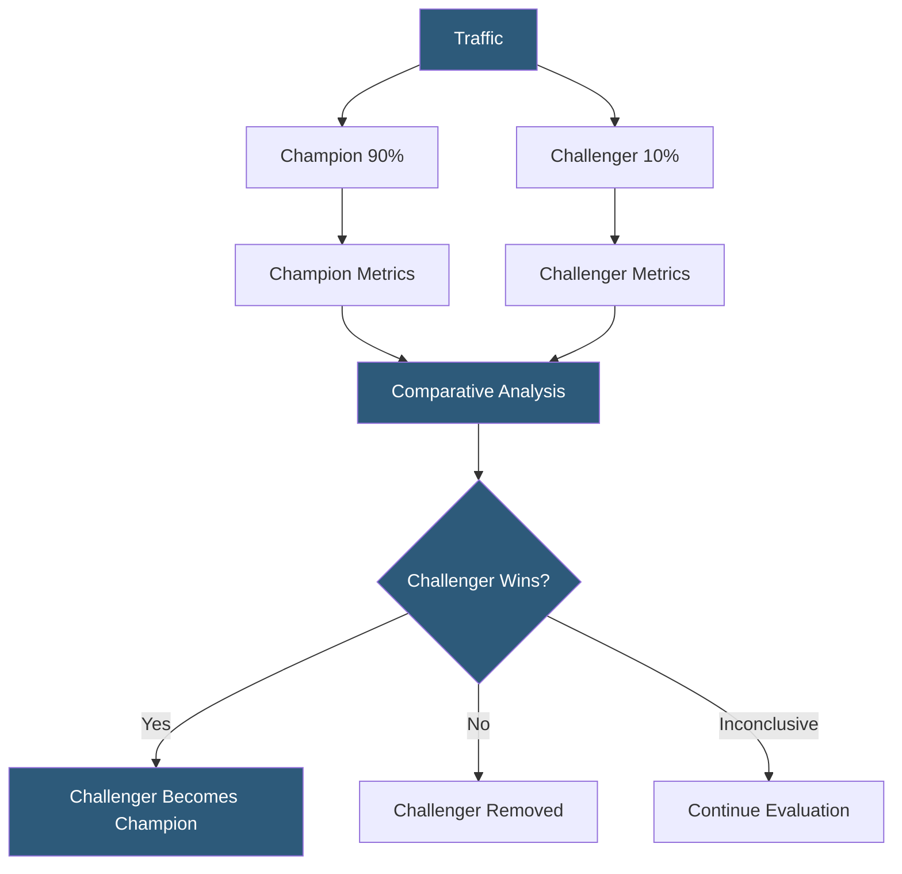

**Category:** AI Model Monitoring & Observability
**Difficulty:** Intermediate
**Reading time:** 5 min read

---

Champion-challenger testing is a structured framework for continuously evaluating model improvements in production by simultaneously running the current best model (champion) against one or more experimental candidates (challengers). It formalizes the model improvement lifecycle by embedding competitive evaluation directly into the production serving architecture.

- **Champion** — the current best-performing model version serving the majority of production traffic
- **Challenger** — an experimental model candidate receiving a small portion of traffic for live performance comparison
- **Traffic allocation** — the percentage split between champion and challenger (typically 90-95% champion, 5-10% challenger)
- **Promotion criteria** — predefined metric thresholds a challenger must meet or exceed to replace the champion
- **Demotion criteria** — metric degradation thresholds that automatically remove a challenger from traffic allocation
- **Multi-challenger** — testing multiple challenger models simultaneously against the champion using a fractional traffic split
- **Evaluation period** — the minimum time or observation count required before statistical comparison is meaningful

Champion-challenger testing differs from one-time A/B tests by being a persistent production pattern rather than a time-bounded experiment. The champion model consistently serves the majority of traffic while a rotation of challengers are evaluated continuously—when a challenger outperforms the champion, it is promoted to champion status and a new challenger can be introduced.

The traffic management layer handles the split: a routing service assigns incoming requests to champion or challenger based on a deterministic hash of a stable request attribute (user ID, session ID). Challenger traffic allocation is kept small (5-10%) to limit user exposure while still accumulating sufficient samples for statistical comparison within days rather than weeks.

Evaluation frameworks compare champion and challenger on a defined metric hierarchy: primary metrics (accuracy, AUROC, business KPI), secondary metrics (additional quality dimensions), and guardrail metrics (latency, error rate, availability). A challenger must outperform the champion on primary metrics without degrading guardrail metrics beyond tolerance.

Statistical analysis uses sequential testing methods (Sequential Probability Ratio Test, mSPRT) rather than fixed-horizon tests, because champion-challenger tests run continuously and require valid inference at any analysis point without inflating false positive rates through multiple comparisons.

Automated promotion and demotion workflows reduce operational overhead: when a challenger achieves statistical significance on promotion criteria, an automated workflow (feature flag update, load balancer rule change) promotes the challenger to champion status. Demotion triggers fire when a challenger crosses guardrail thresholds, removing it from traffic allocation automatically.

- Continuous model improvement in a recommendation system where challengers are evaluated against the current champion
- Financial services models where new regulatory-compliant models must demonstrate live performance before fully replacing champions
- LLM-powered features testing new prompt templates or model versions as challengers
- Sequential model development where each improved model version is evaluated as a challenger before becoming the new champion
- Organizations running permanent champion-challenger infrastructure as a standard model governance requirement

| Advantage | Disadvantage |
|-----------|--------------|
| Formalizes continuous improvement with live evidence rather than offline evaluation | Maintaining challenger serving infrastructure adds operational complexity |
| Automated promotion reduces manual gatekeeping while maintaining quality standards | Multi-challenger testing with small traffic splits requires long evaluation periods for significance |
| Sequential testing methods enable valid analysis without waiting for fixed sample sizes | Champion-challenger isolation from other A/B tests requires careful experiment collision management |
| Persistent pattern creates organizational expectation of continuous model improvement | Automated demotion requires conservative guardrail thresholds to avoid false demotions |

- [A/B Testing for Models](ab-testing-for-models.md)
- [Shadow Model Deployment](shadow-model-deployment.md)
- [Model Version Comparison](model-version-comparison.md)

---
*Part of the [AI Model Monitoring & Observability](index.md) category · [Back to Master Index](../../index.md)*
