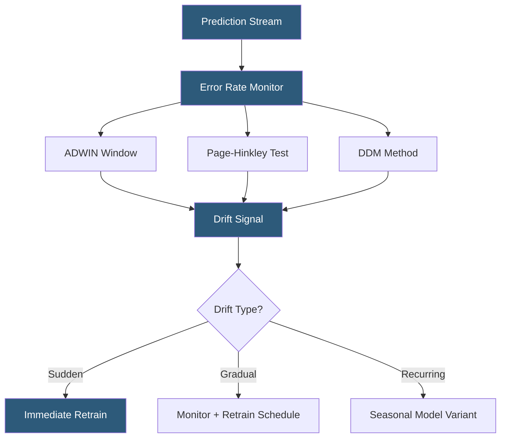

**Category:** AI Model Monitoring & Observability
**Difficulty:** Advanced
**Reading time:** 7 min read

---

Concept drift monitoring tracks changes in the underlying relationship between input features and target outcomes (P(Y|X)), which renders trained models stale even when input distributions remain stable. Detecting concept drift requires ground truth labels and more sophisticated methods than input distribution monitoring alone.

- **Concept drift** — change in P(Y|X): the conditional distribution of the target given features, representing a shift in the real-world relationship the model learned
- **Virtual drift** — input distribution shift (covariate shift) without P(Y|X) change; may not require retraining if the model generalizes
- **Real concept drift** — genuine P(Y|X) change requiring model retraining to maintain accuracy
- **ADWIN (Adaptive Windowing)** — online drift detection algorithm that maintains a sliding window and detects mean shifts in a stream of model accuracy values
- **Page-Hinkley test** — sequential hypothesis test detecting persistent shifts in the mean of a monitored metric stream
- **DDM (Drift Detection Method)** — technique monitoring the error rate of a classifier over time, using statistical bounds to detect when error rate increases beyond training-time levels
- **Delayed ground truth** — the time gap between model prediction and availability of the actual outcome, which constrains real-time concept drift detection

Concept drift monitoring depends on ground truth labels, making it fundamentally different from input drift monitoring. The core idea is to track model error rate (or other accuracy metrics) over time as a sequence of values and apply statistical change detection to identify when the error rate has shifted beyond expected training-time levels.

ADWIN maintains a data structure of recent accuracy values with an adaptive window size. When a statistically significant difference is detected between the older portion and the recent portion of the window, ADWIN shrinks the window to exclude the pre-drift data and signals drift. The adaptive window handles gradual drift by growing the window during stable periods and contracting it when drift begins.

The Page-Hinkley test accumulates the difference between observed and expected error rate values. When this cumulative sum exceeds a threshold, it signals a persistent mean shift—indicating sustained concept drift rather than temporary noise. It is particularly effective for detecting gradual drift that accumulates slowly.

In practice, concept drift monitoring systems operate on batches of labeled predictions rather than a continuous stream, because ground truth labels arrive with delay. The monitoring pipeline: (1) collects predictions from a time window, (2) waits for ground truth labels to arrive, (3) computes accuracy metrics on the matched pairs, (4) applies change detection algorithms to the metric history.

Drift type classification guides the response. Sudden drift (e.g., a regulatory change immediately altering risk patterns) warrants immediate retraining. Gradual drift (e.g., slow demographic shifts in a customer base) warrants scheduled retraining on a cadence. Recurring drift (e.g., holiday season patterns) warrants time-aware model variants rather than retraining.

- Monitoring a fraud detection model after a major data breach creates new fraud patterns
- Detecting gradual concept drift in a churn prediction model as market conditions evolve
- Identifying recurring concept drift in seasonal demand forecasting to trigger time-aware model updates
- Automated retraining pipelines triggered by ADWIN-detected error rate increases
- Distinguishing virtual drift (input shift without P(Y|X) change) from real concept drift to avoid unnecessary retraining

| Advantage | Disadvantage |
|-----------|--------------|
| Error rate monitoring detects real model degradation, not just distributional changes | Requires ground truth labels which may be unavailable or significantly delayed |
| Online methods (ADWIN, PHT) work on streams without requiring batch accumulation | Online change detection algorithms have hyperparameters requiring careful calibration |
| Drift type classification enables proportionate responses rather than automatic retraining | Distinguishing concept drift from virtual drift requires additional analysis |
| Automated retraining triggers reduce time-to-recovery for sudden drift events | False positives trigger expensive retraining jobs; threshold calibration is critical |

- [Model Drift Detection](model-drift-detection.md)
- [Data Drift Analysis](data-drift-analysis.md)
- [Prediction Drift Tracking](prediction-drift-tracking.md)

---
*Part of the [AI Model Monitoring & Observability](index.md) category · [Back to Master Index](../../index.md)*
