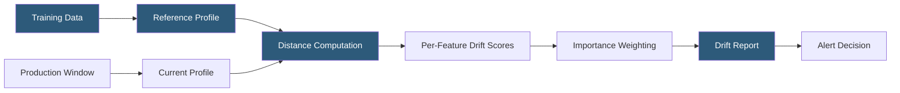

**Category:** AI Model Monitoring & Observability
**Difficulty:** Intermediate
**Reading time:** 6 min read

---

Data drift analysis quantifies and characterizes changes in the statistical properties of data flowing through ML pipelines over time. Unlike model drift (which focuses on prediction outcomes), data drift analysis focuses specifically on the input feature distributions, enabling early detection before model performance is impacted.

- **Feature distribution** — the statistical description of values a feature takes across a population, characterized by its probability density or frequency counts
- **Reference distribution** — baseline distribution captured from training data or a representative historical production window
- **Current distribution** — distribution computed over a recent production window being compared against the reference
- **Statistical distance metric** — numerical measure of divergence between two distributions (PSI, JS divergence, Wasserstein, KL divergence)
- **Drift report** — comprehensive output document comparing reference and current distributions across all features with computed drift scores
- **Feature importance weighting** — prioritizing drift alerts from features with high contribution to model predictions over less impactful features
- **Temporal segmentation** — analyzing drift patterns across different time segments to distinguish seasonal variation from genuine distribution shift

Data drift analysis begins with characterizing the reference distribution for each feature. For continuous numeric features, this involves computing a binned histogram with a defined number of equal-frequency or equal-width bins, capturing the proportion of values in each bin. For categorical features, it involves computing the frequency of each category value.

The production window's distribution is computed using identical binning boundaries established from the reference, ensuring comparable bucket definitions. This consistency is critical: using adaptive binning in the current window would produce incompatible representations that inflate apparent drift.

Distance metrics are then applied. PSI is calculated as the sum across bins of (P_current - P_reference) × log(P_current / P_reference), producing a non-negative score where higher values indicate more drift. Jensen-Shannon divergence provides a symmetric, bounded (0-1) alternative. For continuous distributions without binning, Wasserstein distance (earth mover's distance) computes the minimum "cost" to transform one distribution into the other.

Feature importance weighting addresses the prioritization problem: a high-cardinality categorical feature with low model importance might exhibit high PSI during routine business changes without impacting predictions. Multiplying drift scores by feature importance (derived from training-time SHAP values or permutation importance) produces a business-impact-adjusted drift priority ranking.

Temporal segmentation is essential for seasonal businesses. Computing a single drift score against a training baseline may generate false alerts during expected seasonal patterns. Dynamic baselines using the same calendar period from the prior year, or rolling baselines tracking 28-day windows, separate genuine drift from predictable seasonal variation.

- Weekly feature drift reports for a credit risk model monitoring changes in applicant population characteristics
- Real-time data drift dashboards tracking feature distributions for a high-frequency trading signal model
- Root cause analysis determining whether a model accuracy degradation stems from input data changes or concept drift
- Data pipeline health monitoring detecting upstream schema changes or encoding errors through feature drift
- Regulatory model validation reports documenting feature distribution stability over audit periods

| Advantage | Disadvantage |
|-----------|--------------|
| Feature-level drift scores pinpoint which inputs changed, accelerating root cause investigation | Binning boundaries established from training data may not represent production distribution shapes well |
| Importance-weighted drift prioritization reduces alert noise from low-impact feature changes | Wasserstein distance computation is expensive for large high-dimensional datasets |
| Temporal segmentation separates genuine drift from expected seasonal variation | Choosing appropriate reference baselines requires domain expertise and iterative refinement |
| Automated drift reports standardize communication of data health to non-technical stakeholders | High false positive rates from overly sensitive thresholds can desensitize teams to genuine alerts |

- [Model Drift Detection](model-drift-detection.md)
- [Concept Drift Monitoring](concept-drift-monitoring.md)
- [Prediction Drift Tracking](prediction-drift-tracking.md)

---
*Part of the [AI Model Monitoring & Observability](index.md) category · [Back to Master Index](../../index.md)*
