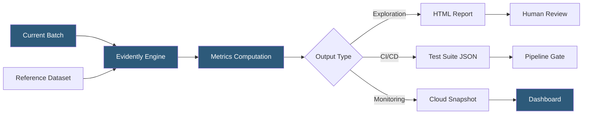

**Category:** AI Model Monitoring & Observability
**Difficulty:** Intermediate
**Reading time:** 6 min read

---

Evidently AI is an open-source Python library and cloud platform for evaluating, testing, and monitoring ML models and data pipelines. It generates visual HTML reports and structured test results covering data drift, data quality, model performance, and target drift, making it highly accessible for teams at any scale.

- **Report** — interactive HTML visualization of ML metrics for exploratory analysis and debugging
- **Test Suite** — programmatic quality assertion framework producing pass/fail results suitable for CI/CD integration
- **Metric** — individual measurable quantity (DataDriftTable, ClassificationQualityMetric, TextDescriptorsDriftMetric) computed over a dataset
- **Preset** — bundled collection of related Metrics or Tests for common monitoring scenarios (DataDriftPreset, RegressionPreset)
- **Column Mapping** — configuration object telling Evidently which columns represent predictions, targets, and features
- **Reference dataset** — baseline dataset (typically training or validation data) against which current batch is compared
- **Snapshot** — serialized metric computation result stored for comparison over time in Evidently Cloud

Evidently operates on pandas DataFrames or file paths to CSV/Parquet data. The core API involves constructing a Report or TestSuite object by specifying which Metrics or Tests to include, then calling `.run(reference_data, current_data, column_mapping)`. This design makes Evidently straightforward to integrate into existing Python-based ML workflows without platform dependencies.

Reports produce rich interactive HTML visualizations: distribution comparison plots for each feature, performance metric tables, and drift score summaries. These are valuable for ad-hoc investigation—a data scientist can generate a drift report locally in under 10 lines of Python.

Test Suites transform the same computations into machine-readable assertions. Each test has a condition (e.g., `TestNumberOfDriftedColumns(lt=5)`) and produces a structured result with status, description, and computed value. Tests are composable—teams assemble test suites appropriate to their specific data contract. Failures return non-zero exit codes, enabling direct use as pipeline gates in Airflow DAGs, GitHub Actions workflows, or other CI/CD systems.

Evidently Cloud extends the open-source library with persistent storage, scheduling, and a monitoring dashboard. Snapshots (serialized metric computations) are uploaded to the cloud platform, creating a time-series of model health indicators. Alerting rules evaluate stored snapshots against configured thresholds, sending notifications via Slack or email.

For LLM evaluation, Evidently includes text descriptors (sentiment, text length, sentence count, out-of-vocabulary rate) and semantic similarity metrics using embedding distance, providing LLM quality monitoring without requiring specialized infrastructure.

- Weekly batch ML pipeline quality gates that fail deployment if drift exceeds defined thresholds
- Generating visual drift analysis reports for stakeholder communication after model performance incidents
- Building custom ML monitoring solutions in self-hosted environments without SaaS dependencies
- Comparing data quality between training, validation, and production datasets during model development
- Open-source LLM evaluation pipelines tracking response quality metrics across prompt template versions

| Advantage | Disadvantage |
|-----------|--------------|
| Open-source with no licensing cost reduces barrier to entry | Self-hosted monitoring requires building custom storage and scheduling infrastructure |
| HTML reports provide high-quality visualizations without dashboard infrastructure | Batch-oriented design adds latency to real-time streaming monitoring use cases |
| Test Suites integrate naturally with existing CI/CD pipeline frameworks | Test threshold calibration requires domain expertise and iterative tuning |
| Wide metric library covers drift, quality, performance, and LLM evaluation | Evidently Cloud features require a paid subscription for production-scale persistence |

- [Evidently Test Suites](evidently-test-suites.md)
- [Whylabs AI Observability](whylabs-ai-observability.md)
- [Data Drift Analysis](data-drift-analysis.md)

---
*Part of the [AI Model Monitoring & Observability](index.md) category · [Back to Master Index](../../index.md)*
